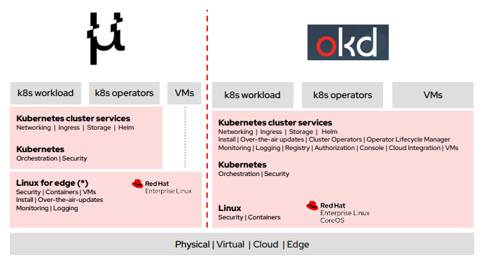
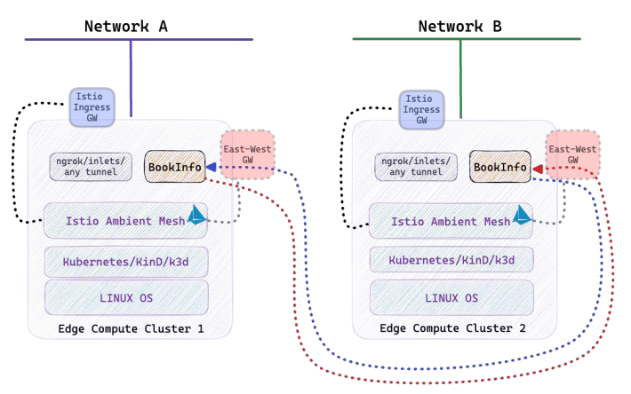
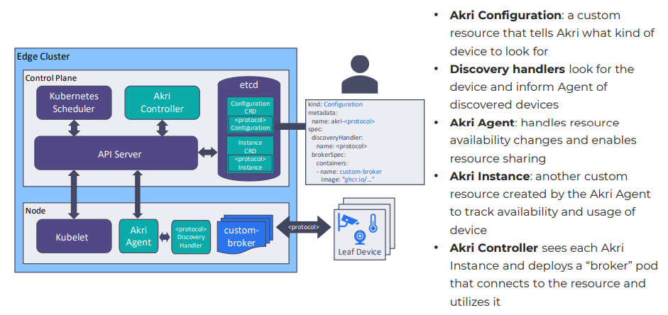
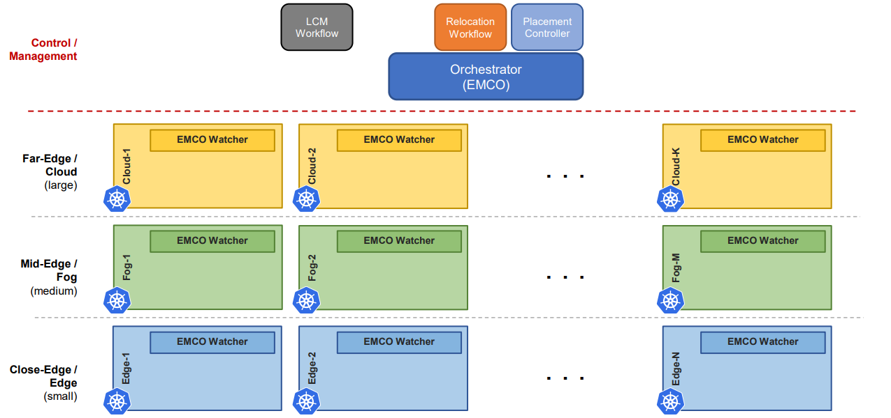
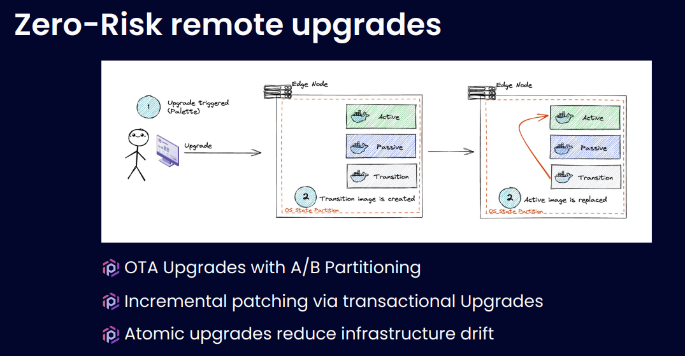

<!---
Comment Here
--->

# KubeCon 2023 Edge Day EU

---

# [Opening Remarks](https://www.youtube.com/watch?v=LUMI_p-1i4Y&list=PLj6h78yzYM2NKPD0AwnJqbU_aBvzEdSoT&index=1)

- 75 % Data generated by Edge IoT devices, 4x bigger than cloud.
- Consideration about energy, performance, security, ML/AI OPs from many aspect.
- Originally most of the data is generated at edge.
- It is all about community, take the effort to meet people!

<!---
Comment Here
--->

---

# [Building a Kubernetes Offering for Small Edge Devices](https://www.youtube.com/watch?v=MnNznpPXjO4&list=PLj6h78yzYM2NKPD0AwnJqbU_aBvzEdSoT&index=2)

- The right balance between functionality and hardware footprint.
- Some customers are looking for the solution from cloud-native DevOps.
- MicroShift minimizes the rootfs to fit in the kubernetes.
- Storage needs to be there using CSI, this is actual situation.

<!---
Comment Here
--->

---

<!---
Comment Here
--->

---

# [How a Service Mesh Enhances EdgeComputeOps](https://www.youtube.com/watch?v=g4o_7gaQCZY&list=PLj6h78yzYM2NKPD0AwnJqbU_aBvzEdSoT&index=3)

- Network is critical issue for edge IoT devices.
- Edge can be categorized into Near, Far and Micro edges.
- Istio Ambient Mesh Approach Introduction for Edge.

<!---
Comment Here
--->

---

<!---
Comment Here
--->

---

# [Sharpen Your Edge Three Ways With Kubernetes](https://www.youtube.com/watch?v=gdncARKCEOY&list=PLj6h78yzYM2NKPD0AwnJqbU_aBvzEdSoT&index=4)

Scale edge efficiently

- Manage edge holistically
- Automate repetitive edge management
- Design edge implementations at scale
- Contain edge costs at scale

<!---
Comment Here
--->

---

# [Securely Interacting with Edge Devices](https://www.youtube.com/watch?v=hT7bGNKEZk4&list=PLj6h78yzYM2NKPD0AwnJqbU_aBvzEdSoT&index=6)

Akri: A Kubernetes Resource Interface

- Makes connections to IoT devices via their protocols (OPC UA, ONVIF, udev, etc.)
- New devices are detected automatically, making scaling up or down very easy
- Devices are registered as Kubernetes resources, just like memory or CPUs
- Workloads can be assigned to specific devices or group of devices, even if attached to other nodes

<!---
Comment Here
--->

---

<!---
Comment Here
--->

---

# [Smart Workload Migration Across Multiple Clusters](https://www.youtube.com/watch?v=-x3tnJ84p-4&list=PLj6h78yzYM2NKPD0AwnJqbU_aBvzEdSoT&index=7)

- very high speed, low latency, and massive connectivity.
- unmanned aerial vehicles, autonomous vehicles, ehealth, and video streaming, have mobility needs.
- identify a functional gap in the Edge systems, to relocate Edge applications between Edge Hosts.

<!---
Comment Here
--->

---

<!---
Comment Here
--->

---

# [Fruit-Picking Robots Powered by K8s](https://www.youtube.com/watch?v=PB8TdTGmvKA&list=PLj6h78yzYM2NKPD0AwnJqbU_aBvzEdSoT&index=9)

- Use case for Robotics and Robot application
- It’s complex to manage multiple hosts installations at scale
- Gathering status for all assets was still too manual
- Operating multiple platforms is hard
- Extra security needs to be considered — OS compliance and manual encryption

<!---
Comment Here
--->

---

<!---
Comment Here
--->

---

# Consideration/Ideas

- Zero-Down time upgrade on edge
  - having the pre-initialize the container while current on is still running except hardware bindings, then if pre-initialization completes it can switch into the new one.
  - the problem is we cannot be sure if it guarantees it does not break the application until we run... but this could reduce the upgrading time significantly.

<!---
Comment Here
--->

---

# Consideration/Ideas

- Location awareness
  - Is this something application should manage? if the system(k8s) manages the deployment based on the location or any dynamic sensing data, it would be much easier to application perspective.

<!---
Comment Here
--->
