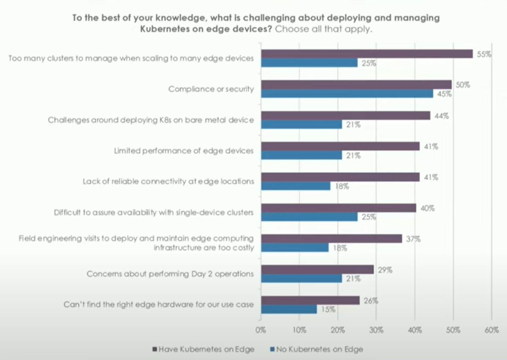
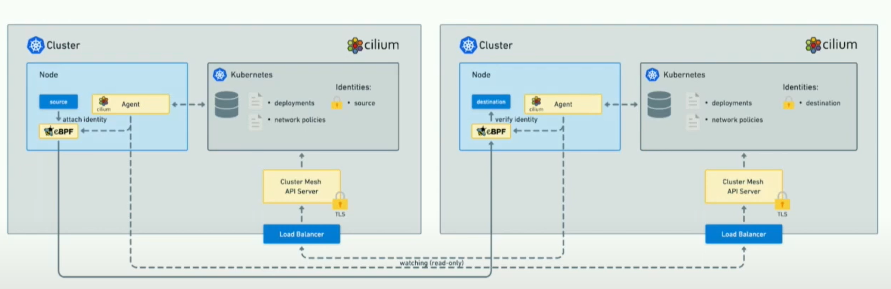
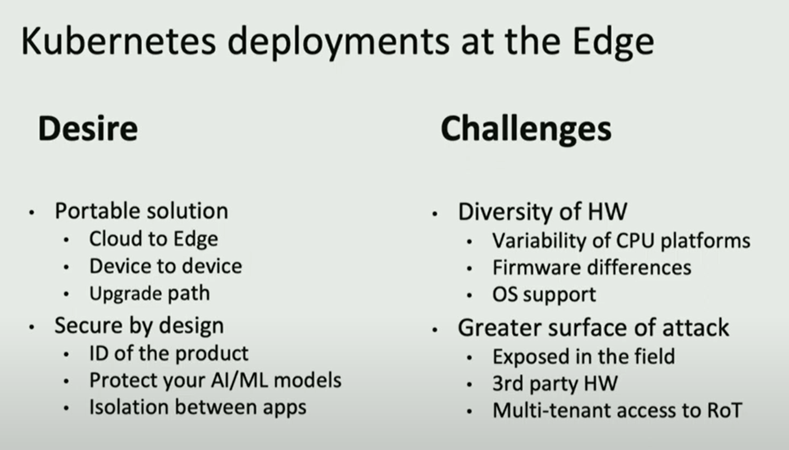

<!---
Comment Here
--->

# KubeCon 2022 Edge Day NA

---

# [Opening Remarks](https://www.youtube.com/watch?v=QBi246kzzhM&list=PLj6h78yzYM2OvaVMx6F1kJs0hxYOIdr8S&index=4)

- 75 % Data generated by Edge IoT devices?
- Bringing application to the people and environment.
- Consideration about energy, performance, security from many aspect.
- It is all about community, take the effort to meet people!

<!---
Comment Here
--->

---

# [Time to Unlock the Edge Potential at Scale](https://www.youtube.com/watch?v=01ov6Q33Css&list=PLj6h78yzYM2OvaVMx6F1kJs0hxYOIdr8S&index=2)

- [kairos](https://kairos.io/)
  - The immutable Linux meta-distribution for edge Kubernetes.
  - https://github.com/kairos-io/kairos
  - https://kairos.io/docs/

<!---
Comment Here
--->

---

<!---
Comment Here
--->

---

# [Containers Where YOU Want Them: All the Way to the Edge](https://www.youtube.com/watch?v=Ftox9Wt0Auw&list=PLj6h78yzYM2OvaVMx6F1kJs0hxYOIdr8S&index=3)

- Using upstream mainline as architecture.
- Probably all kubernetes feature would not be required to edge use cases.
- Workload should be adjusted such as AI models during drone flying.
- [Redhat Device Edge](https://www.redhat.com/en/technologies/device-edge)
  - 100% Open Source / Supported
  - ARM 64 supported (2GB / 2 cores / device)

---

# [WebAssembly Based AI as a Service on the Edge with Kubernetes](https://www.youtube.com/watch?v=LU6ru7h4r38&list=PLj6h78yzYM2OvaVMx6F1kJs0hxYOIdr8S&index=4)

- high-performance machine-independent byte code.
- expecting use case for far edge devices such as AI processing.
- lightweight container compared to linux container such as docker.
- extreme resource constrained platform, image size is pretty small.

---

---

- Wasm can be future of serverless computing instead of typical FaaS as JavaScript and Python.
- AI interface as FaaS for future.
- also comes with easy deployment and management.
- constrained interfaces would be the situation against regular container. for example, complicated application using network or distributed system cannot be supported.
- Reference
  - [wasmtime](https://docs.wasmtime.dev/introduction.html)
  - [wasi](https://wasi.dev/)

---

# [Accelerating Data Processing and Consumption for Building Modern Apps](https://www.youtube.com/watch?v=b4NlOS_Evo0&list=PLj6h78yzYM2OvaVMx6F1kJs0hxYOIdr8S&index=5)

- Workloads are moving to the edge devices.
- 1st half is about business background and motivation.
- Example Workflow: Automated Package Sort.

---

# [Which Edge Are You on? Service Affinity with Cilium Cluster Mesh](https://www.youtube.com/watch?v=Chk2PTS2Bwc&list=PLj6h78yzYM2OvaVMx6F1kJs0hxYOIdr8S&index=6)

- Cilium and eBPF introduction.
- cross-cluster unified network data plane and service mesh.
- eBPF kernel configuration must be enabled.
- Cluster mesh for High Availability, Shared Services, Local/Remote Service Affinity,

---

---

# [Enable a Cloud Native Edge Without Lock-Ins - Marc Meunier, Arm](https://www.youtube.com/watch?v=eVHyCyNGs8E&list=PLj6h78yzYM2OvaVMx6F1kJs0hxYOIdr8S&index=7)

- pain to migrate the application one platform to another.
- [arm PROJECT CASSIN](https://www.arm.com/solutions/infrastructure/edge-computing/project-cassini)
  - SystemReady, standard OS just boots.
  - PARSEC, security abstraction to access the hardware root of trust. (CNCF incubation)
  - common API for security interfaces.

---

---

# [Kubernetes at Home to Host Entertainment & Productivity Apps](https://www.youtube.com/watch?v=x5r-ixzasj8&list=PLj6h78yzYM2OvaVMx6F1kJs0hxYOIdr8S&index=10)

- 

---

