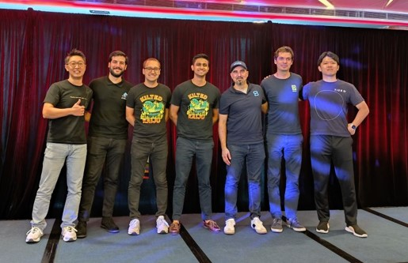
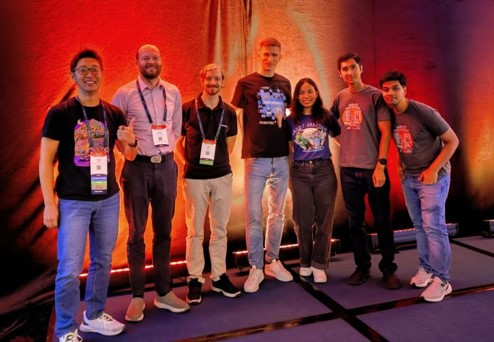
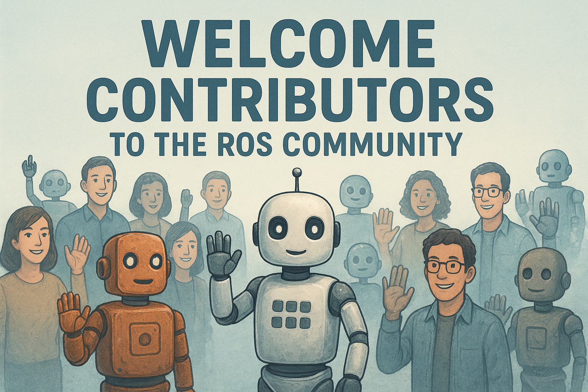

# [ROSCon 2025 Recap](https://roscon.ros.org/)

<!---
Comment here
--->

---

<!---
Organizing Committee, monthly meeting to put together for ROSCon.
My assignment for ROSCon 2025 is,
- Executive Committee: Decision Making, Budgets, Local Chair Communication, Presentations Time Schedule
- Programing Committee: Review Proposals, Feedback to the authors
- Session Chair: ROS RMWs (5 Presentation) and Simulation (5 Presentation)
--->

---

## Statistics

- 950+ attendees
- 51+ countries
- 354+ companies
- 66+ universities
- 56 sponsors
- 10 sponsored mini-workshops
- 464 workshop attendees
- 8 birds of a feather sessions

<!---
Comment here
--->

---

## ROS Project in Onepage

- ROS 1 (Noetic) E.O.L
- Kilted Kaiju Release: RMW Zenoh, RCL Python Events Executor, Action Introspection, Pixi on Windows, FastDDS v3
- ROS 2 Vision
  - Embrace Embodied AI
  - Expand Accessibility
  - **Support Production** ([rcl_logging_syslog](https://github.com/fujitatomoya/rcl_logging_syslog))
- ROS Lyrical Luth
  - May 23, 2026 (World Turtle Day), LTS until May 2031
  - Target Platforms (Tentative), Ubuntu 26.04, RHEL 10, Windows 11

<!---
Embrace Embodied AI: Position ROS 2 as the preferred framework for developing and deploying AI-driven robotic systems. (rcl::tensor, physical AI interfaces/standards)
Expand Accessibility: Lower the barrier to entry to get started with ROS. and improve cross-platform tooling + documentation. (Pixi, Documentation, Python Performance)
Support Production: Empower professional developers to build robust, scalable, and maintainable robotics applications. (Bazel, Rust)
--->

---

---

## ROS RMWs

### RMW What? (Apex.AI)

- How RMW is constructed and designed?
- How we can develop the rmw implementation? e.g) [rmw_email](https://github.com/christophebedard/rmw_email)

### Zenoh Strikes Back (Intrinsic / Zetta Scale)

- New rmw_zenoh implementation introduction
- Differentiating feature of Zenoh such as down sampling

<!---
Comment here
--->

---

### From DDS to Zenoh (Dexory / Zetta Scale)

- Migration experience from DDS (Cyclonedds) to Zenoh
- DDS is sometimes too much, Zenoh would be the choice

### What’s new in FastDDS v3 (eProsima)

- New features in FastDDS v3 for Kilted Kaiju
- [ROS 2 Easy Mode](https://docs.vulcanexus.org/en/jazzy/rst/enhancements/easy_mode/easy_mode.html), XTypes v1.3 for Extensible and Dynamic Topic Types for DDS

### Agnocast Zero-Copy IPC (TIER IV)

- Side channel path to achieve zero copy for unbound message types
- Not a rmw implementation, built on top of rclcpp client interface

<!---
Comment here
--->

---

## ROS Simulation

### Realistic Terrain Simulation (Intrinsic)

- Space ROS
- ways to create realistic terrain in Gazebo from real world data.

### Evaluation of ROS 2 Simulators (Robotnik)

- Gazebo, Webots, CoppeliaSim, Unity3D, Isaac Sim, and O3DE
- Comparison / Pros&Cons

<!---
Comment here
--->

---

### Ray Tracing Everywhere (Intrinsic)

- multi-LiDAR simulation plugin
- Rust implementation of the WebGPU standard

### New ROS Simulation Standard (RobotecAI, Nvidia, Intrinsic)

- simulation interfaces package, a new standard for ROS, and its implementation in popular simulators. 

### Drones to Research

- packages that enable full control of drones
- seamless single- or multi-drone operation

<!---
Comment here
--->

---

<!---
Comment here
--->

---

## Aliases

- [ROS Project Management Committee](https://docs.ros.org/en/rolling/The-ROS2-Project/Governance.html#the-ros-project-management-committee-ros-pmc): Who are behind ROS?
- [Open Robotics Discourse](https://discourse.openrobotics.org/): Let's open discussion!
- [Robotics Stack Exchange](https://robotics.stackexchange.com/): Any questions welcome!
- [ROS Github](https://github.com/ros2): Contribution Issues, Reviews and PRs.
- [ROS Asia Pacific Developer Meeting](https://github.com/fujitatomoya/ros-apac-developer-meeting)
- **[ROS Japan Developer Meeting](https://github.com/fujitatomoya/ros-japan-developer-kaigi)**

<!---
Comment here
--->

---

# ROS Japan Developer Kaigi(会議)

ROS本線を開発しよう🤖
技術課題をシェアしよう🧑‍💻👩‍💻
目指せ！ROSコミッター＆メンテナー🚀🚀

# Picture & Join Now!

<!---
Note: This QR code leads to github project, that is the main repo.
--->
