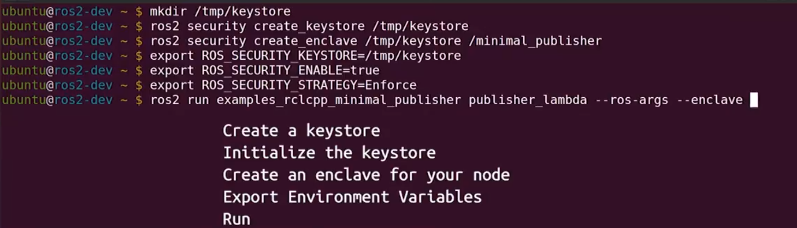
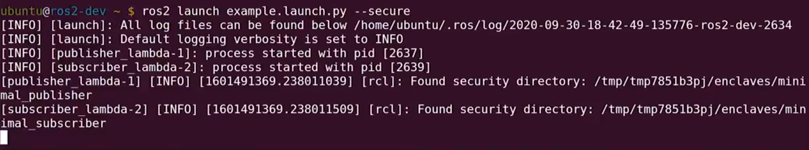
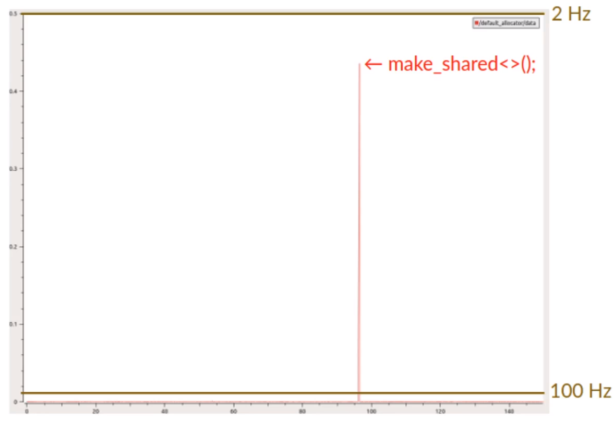
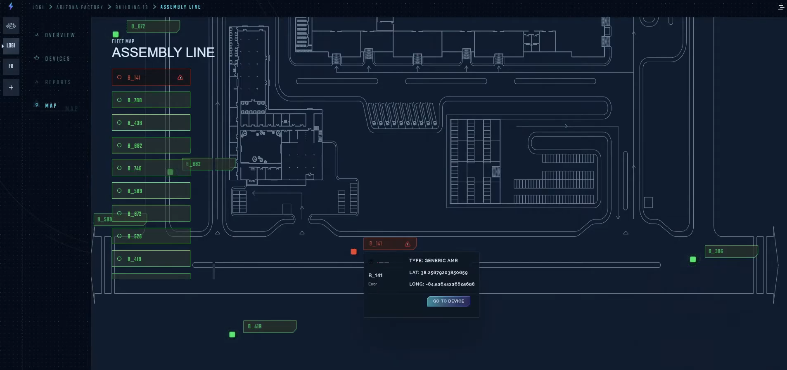

<!---
Comment Here
--->

# ROS World 2020 Recap

## Lightning Talk from Lightning Talks

Tomoya Fujita @ [linkedin](https://www.linkedin.com/in/tomoya-fujita-5bb656b6/) [github](https://github.com/fujitatomoya)

---

# rosbag2

- recording bag file can be split based on file size and duration.
- compression module [zstd](https://github.com/facebook/zstd) for file or message
- QoS automatically adjusted on each topic. also can be overridden.

---

# Security Launch

- Before

---

# Security Launch

- After (Upcoming)

---

# system statistics

- [system_metrics_collector](https://github.com/ros-tooling/system_metrics_collector)
- NodeOption to enable statistics on subscription.
- publishes /statistics type with `statistics_msgs::msg::MetricsMessage`
- CPU & Memory usage
- Linux Only
- External parameter configuration in consideration

---

# Boost Pool Allocation

- it is all about `std default allocator` vs `boost::fast_pool_allocator`
- can be used for intra-process communication.

---

---

---

# ROS + Docker

- Repeatable / Reproducible
- Platform / Distro Dependencies
- Contribution Friendly

- Official Library Images: library/ros:<tag>
- Docker Images:osrf/ros2:<tag>

---

# Object Computing DDS

- DDS can connect between different subnets.
- DDS can connect to the cloud.
- DDS can connect over the Internet.
- DDS can communicate on different network.

---

# Freedom Robotics

