# ROS 2 Overview Introduction

This is meant to explain ROS 2 basics, design, distribution and features just in overview.
Our centralized mainline documentation site is [ROS 2 documentation](https://docs.ros.org/) if we need to know more details.

<!---
Comment here
--->

---

# Agenda

- Governance
- Distributions
- Architecture / Design
- Basic Concepts
- Samples / Demos
- Remarkable Features
- 3rd Party Packages

<!---
Comment here
--->

---

# Governance

## [Open Source Robotics Alliance](https://osralliance.org/)

is a new initiative of the OSRF to organize and strengthen project governance and community involvement. The OSRA is a mixed membership and meritocratic model, following other successful foundations for open-source projects.

<!---
Comment here
--->

---

## [ROS Project Management Committee](https://docs.ros.org/en/rolling/The-ROS2-Project/Governance.html#the-ros-project-management-committee-ros-pmc)

The ROS Project Management Committee is responsible for the day-to-day operations of the ROS 2 project. The ROS PMC consists of the Project Leader, the ROS PMC Members (who have full voting rights)

See [Current ROS PMC Constituents](https://docs.ros.org/en/rolling/The-ROS2-Project/Governance.html#current-ros-pmc-constituents).

<!---
Comment here
--->

---

## Community Sites

- [ROS 2 Github](https://github.com/ros2)
  - Development, Design, Source code
- [ROS Discourse](https://discourse.ros.org/)
  - Discussion / Announcement / Release
- [Robotics Stack Exchange](https://robotics.stackexchange.com/)
  - Centralized QA platform
- Working Group / Specific Interest Group
  - Under construction since OSRA structure transition.

<!---
Comment here
--->

---

# [Distributions](https://docs.ros.org/en/rolling/Releases.html)

| Distribution Name | Release Date   | End Of Life Date |
| :---------------- | :------------- | :--------------- |
| Kilted Kaiju      | May 2025       | N.A              |
| Jazzy Jalisco     | May 23rd, 2024 | May 2029         |
| Iron Irwini       | May 23rd, 2023 | November 2024    |
| Humble Hawksbill  | May 23rd, 2022 | May 2027         |

<!---
Comment here
--->

---

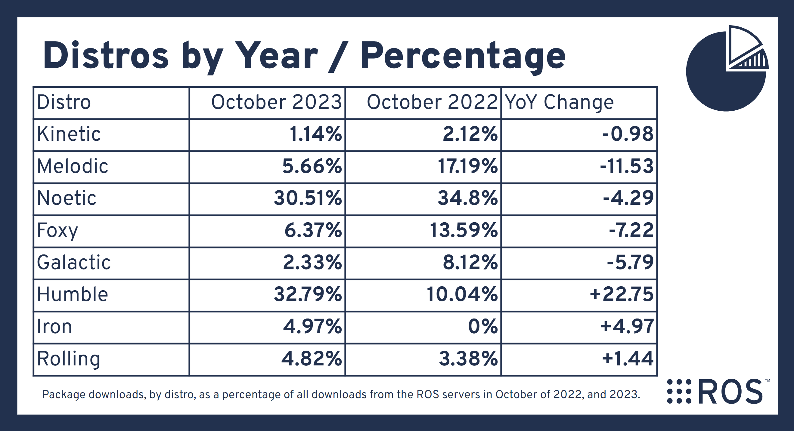

<!---
Comment here
--->

---

# Platform & Dependencies

- C++ Standard C++17 or later
- Python version 3.6 or later
- colcon to meta-build system
  - colcon handles ament(ROS 2) and catkin(ROS 1)
- `.msg`, `.srv` and `.action` files
  - Basically compatible, but might need to be updated
- [OMG IDL 4.2](https://www.omg.org/spec/IDL/4.2) Support
- Serializer is ROS 2 MiddleWare's responsibility
- Steady, System and ROS clock available

<!---
Comment here
--->

---

<!---
Comment here
--->

---

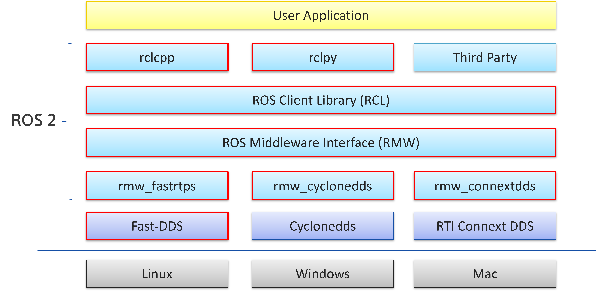

<!---
Comment here
--->

---

# Data Distribution Service

The **OMG Data-Distribution Service for Real-Time Systems® (DDS®)** is the first open international middleware standard directly addressing publish-subscribe communications for real-time and embedded systems.

DDS introduces a virtual **Global Data Space** where applications can share information by simply reading and writing **data-objects** addressed by means of an application-defined name (Topic) and a key. DDS features fine and extensive control of **QoS** parameters, including reliability, bandwidth, delivery deadlines, and resource limits. DDS also supports the construction of **local object models** on top of the Global Data Space.

<!---
Comment here
--->

---

# Basic Concepts

- [Node](https://docs.ros.org/en/rolling/Concepts/Basic/About-Nodes.html) / [LifecycleNode](https://design.ros2.org/articles/node_lifecycle.html) / [Components](https://docs.ros.org/en/rolling/Concepts/Intermediate/About-Composition.html)
- [Executor](https://docs.ros.org/en/rolling/Concepts/Intermediate/About-Executors.html)
- [Topics](https://docs.ros.org/en/rolling/Concepts/Basic/About-Topics.html), [Services](https://docs.ros.org/en/rolling/Concepts/Basic/About-Services.html), [Parameters](https://docs.ros.org/en/rolling/Concepts/Basic/About-Parameters.html) and [Actions](https://docs.ros.org/en/rolling/Concepts/Basic/About-Actions.html)
- [Logging](https://docs.ros.org/en/rolling/Concepts/Intermediate/About-Logging.html)
- [Launch](https://docs.ros.org/en/rolling/Concepts/Basic/About-Launch.html)
- [Bagging]()

<!---
Comment here
--->

---

# [Node](https://docs.ros.org/en/rolling/Concepts/Basic/About-Nodes.html)

- A node can be a component
- Single process can be constructed with multi-components
- Component can be loaded during runtime via component container
- Intra-Process Manager

<!---
Comment here
--->

---

# [Node LifeCycle](https://design.ros2.org/articles/node_lifecycle.html)

allow roslaunch to ensure that all components have been instantiated correctly before it allows any component to begin executing its behaviour. It will also allow nodes to be restarted or replaced on-line.

- Primary State
  - `Unconfigure`, `Inactive`, `Active` and `Finalized`
- Transition State
  - `Configuring`, `ClearningUp`, `ShuttingDown`, `Activating`, `Deactivating` and `ErrorProcessing`

<!---
Comment here
--->

---

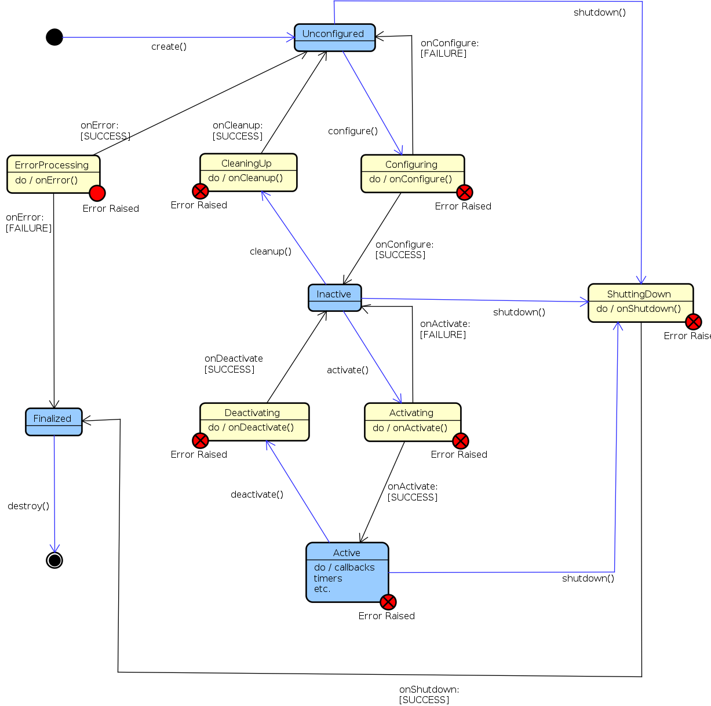

<!---
Comment here
--->

---

# [Components](https://docs.ros.org/en/rolling/Concepts/Intermediate/About-Composition.html)

- Just like ROS1 Nodelet
- Multiple nodes in a single process
- Can load and unload the composable node
- Composable nodes as shared libraries

<!---
Comment here
--->

---

# [Executor](https://docs.ros.org/en/rolling/Concepts/Intermediate/About-Executors.html)

ROS 2 provides executor class aside from Node class, which can be used to dispatch the task to execute the event such as subscription, timer,  service and any waitable so on. application has flexibility to use executor as it likes.

- SingleThreadedExecutor: single thread to dispatch task and execute.
- MultiThreadedExecutor: mulith-thread to dispatch task and execute. (via `std::thread::hardware_concurrency`)
- ~~StaticSingleThreadedExecutor~~ (deprecated): statically collect entities for task. that said once spins, it will not collect or update any entities.
- EventExecutor: Uses events queue in the Executor to execute the entities from associated nodes.

<!---
Comment here
--->

---

# [Topics](https://docs.ros.org/en/rolling/Concepts/Basic/About-Topics.html)

<!---
Comment here
--->

---

# [Service](https://docs.ros.org/en/rolling/Concepts/Basic/About-Services.html)

<!---
Comment here
--->

---

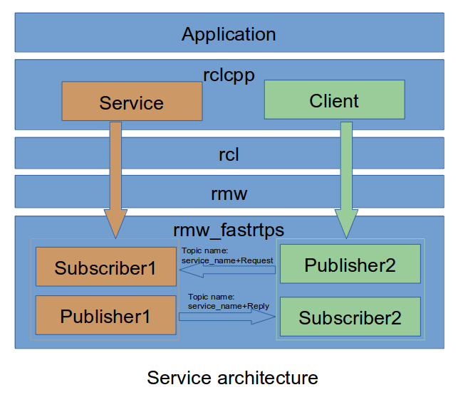

<!---
Comment here
--->

---

# [Parameter](https://docs.ros.org/en/rolling/Concepts/Basic/About-Parameters.html)

- No parameter server
- Parameters are hosted in Node
- Async / Sync Parameter Client
- get, set, list, delete and describe methods
- user callback to validate parameter change

<!---
Comment here
--->

---

# Parameter Events

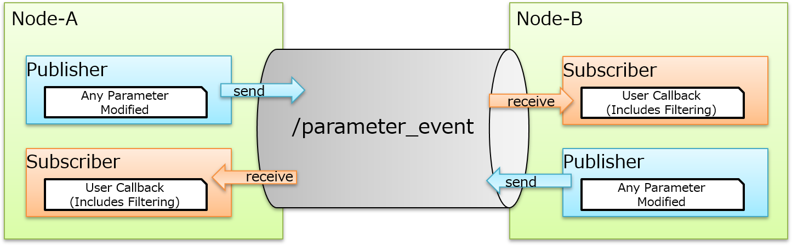

<!---
Comment here
--->

---

# [Actions](https://docs.ros.org/en/rolling/Concepts/Basic/About-Actions.html)

<!---
Comment here
--->

---

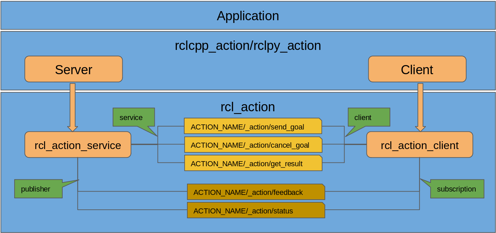

<!---
Comment here
--->

---

# [Logging](https://docs.ros.org/en/rolling/Concepts/Intermediate/About-Logging.html)

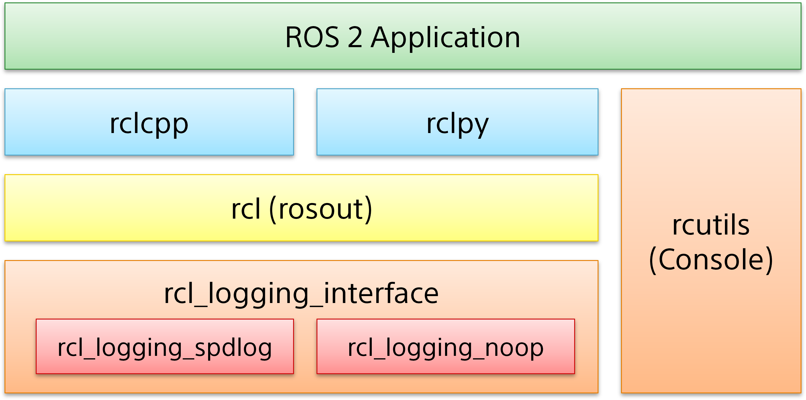

<!---
Comment here
--->

---

- logging subsystem can output the log to console, files and `/rosout` topic.
- `/rosout` topic is to publish and subscribe all logging data in ROS 2 system.
- Multiple severity levels are supported.
- Environmental variables to support log configuration and format.

<!---
Comment here
--->

---

# [Launch](https://docs.ros.org/en/rolling/Concepts/Basic/About-Launch.html)

- Similar with ROS 1 `roslaunch`.
- The launch system in ROS 2 is meant to automate the running of many nodes with a single command.
- ROS 2 launch files can be written in Python, XML, or YAML.
- Parameters, remapping rules arguments and process related events are supported.

see more details for https://design.ros2.org/articles/roslaunch.html.

<!---
Comment here
--->

---

# [rosbag2](https://docs.ros.org/en/rolling/Tutorials/Beginner-CLI-Tools/Recording-And-Playing-Back-Data/Recording-And-Playing-Back-Data.html)

- `ros2 bag` is a command line tool for recording data published on topics and services in your ROS 2 system.
- backend data base can be configured either [MCAP](https://mcap.dev/) (default from Iron) or [SQLite3](https://www.sqlite.org/) (default until humble)
- Not only for topics, but services can be also recorded and playback.

---

# [Demos](https://github.com/ros2/demos) / [Examples](https://github.com/ros2/examples)

- [Topic](https://github.com/ros2/demos/tree/rolling/demo_nodes_cpp)
- [Service](https://github.com/ros2/demos/tree/rolling/demo_nodes_cpp)
- [Parameter](https://github.com/ros2/demos/tree/rolling/demo_nodes_cpp)
- [Action](https://github.com/ros2/demos/tree/rolling/action_tutorials/action_tutorials_cpp)
- [Lifecycle](https://github.com/ros2/demos/tree/rolling/lifecycle)
- [Composition](https://github.com/ros2/demos/tree/rolling/composition)

<!---
### Topic
ros2 run demo_nodes_cpp talker
ros2 run demo_nodes_cpp listener
ros2 topic list
ros2 topic info /chatter
ros2 note list

### Service
ros2 run demo_nodes_cpp add_two_ints_server
ros2 service list
ros2 run demo_nodes_cpp add_two_ints_client

### Parameter
ros2 run demo_nodes_cpp parameter_blackboard
ros2 param set /parameter_blackboard greeting hello
ros2 param list
ros2 param get /parameter_blackboard greeting

### Action
ros2 run action_tutorials_cpp fibonacci_action_server
ros2 action list
ros2 action info /fibonacci
ros2 run action_tutorials_cpp fibonacci_action_client

# Lifecycle
ros2 run lifecycle lifecycle_talker
ros2 run lifecycle lifecycle_listener
ros2 run lifecycle lifecycle_service_client
ros2 lifecycle nodes
ros2 lifecycle get /lc_talker

# Composition
ros2 component types
ros2 run rclcpp_components component_container
ros2 component list
ros2 component load /ComponentManager composition composition::Talker
ros2 component load /ComponentManager composition composition::Listener
ros2 component list
--->

---

# Remarkable Features

- [Quality of Service](https://docs.ros.org/en/rolling/Concepts/Intermediate/About-Quality-of-Service-Settings.html)
- [Physical Domain](https://docs.ros.org/en/rolling/Concepts/Intermediate/About-Domain-ID.html) / [Discovery Range Control](https://docs.ros.org/en/rolling/Tutorials/Advanced/Improved-Dynamic-Discovery.html)
- [ROS 2 Security](https://docs.ros.org/en/rolling/Concepts/Intermediate/About-Security.html)
- [True Zero Copy / Loaned Message](https://docs.ros.org/en/humble/How-To-Guides/Configure-ZeroCopy-loaned-messages.html)
- Sync / Async Publisher Mode
- Wait for Acknowledgement
- [Content Filtered Topics](https://docs.ros.org/en/rolling/Tutorials/Demos/Content-Filtering-Subscription.html)
- [Network Identifier (ToS, DSCP)](https://design.ros2.org/articles/unique_network_flows.html)
- [Micro-Controller Support (Micro-ROS)](https://micro.ros.org/)

---

# QoS (Quality of Service)

- QoS policies such as history, depth, reliability, durability, deadline so on.
- QoS preset profiles, e.g) system_default, sensor_data and service.
- QoS events, callback to be fired based on the event, i.e) deadline missed, liveliness missed.
- QoS incompatibility can happen between publisher and subscriber.
- MachedEvent can be generated when any publisher and subscription establishes or drops the connection between them.

<!---
Comment here
--->

---

# `ROS_DOMAIN_ID` Partition

- [ROS_DOMAIN_ID](https://docs.ros.org/en/rolling/Concepts/Intermediate/About-Domain-ID.html), primary mechanism for having different logical networks share a physical network is known as the Domain ID.

# [Improved Dynamic Discovery](https://docs.ros.org/en/rolling/Tutorials/Advanced/Improved-Dynamic-Discovery.html)

- Discovery protocol initiated in the same subnet By default.
- User can configure the discovery range with environmental variable, such as only localhost, specific peers.

<!---
Comment here
--->

---

# [ROS 2 Security](https://docs.ros.org/en/rolling/Concepts/Intermediate/About-Security.html)

The ability to secure communications among nodes within the ROS 2 computational graph.
Security files enable encryption and authentication, and define policies both for individual nodes and for the overall ROS graph.

see [Setting up security](https://docs.ros.org/en/rolling/Tutorials/Advanced/Security/Introducing-ros2-security.html) for more details.

<!---
Comment here
--->

---

# [Zero Copy Loaned Message](https://docs.ros.org/en/humble/How-To-Guides/Configure-ZeroCopy-loaned-messages.html)

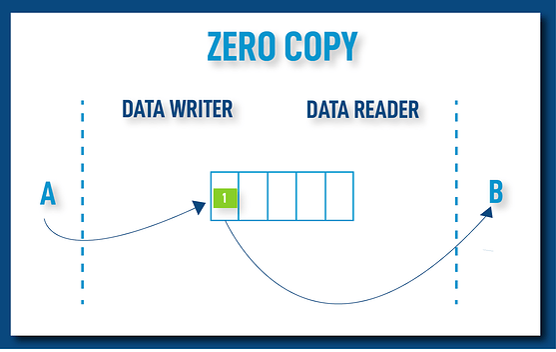

- True Zero Copy / Write Once
- No encapsulation / No Serialization
- Copy-Less communication channel using shared memory.
- Application borrows memory from RMW Implementation.
- Fast-DDS v2.2.0 (ros:galactic or later)

<!---
# Final True Zero Copy Data Sharing
# https://fast-dds.docs.eprosima.com/en/latest/fastdds/use_cases/zero_copy/zero_copy.html
--->

---

- `LoanedMessage`
  - This class needs to be used by application to borrow memory from middleware during publication.
  - [LoanedMessage Talker Demo](https://github.com/ros2/demos/blob/master/demo_nodes_cpp/src/topics/talker_loaned_message.cpp)
- Constraints
  - bound data type only supported. (plain data type)
- Configuration
  - Suitable for `PREALLOCATED_MEMORY_MODE` and `PREALLOCATED_WITH_REALLOC_MEMORY_MODE` memory configurations only
  - see [MemoryManagementPolicy](https://fast-dds.docs.eprosima.com/en/latest/fastdds/api_reference/rtps/resources/MemoryManagementPolicy.html#_CPPv4N8eprosima8fastrtps4rtps22MemoryManagementPolicy24PREALLOCATED_MEMORY_MODEE)

<!---
Comment here
--->

---

| DDS | Tier | Description |
| :--- | :--- | :--- |
| Fast-DDS | 1 | Zero Copy supported. Even with shared memory transport, DDS feature full supported. |
| Cyclonedds | 1 | DDS with shared memory bypass by iceoryx which requires daemon. When using shared memory, DDS feature cannot be supported such as QoS. |
| RTI Connext DDS | 1 | Commercial only, but most featured DDS implementation |
| Eclipse Iceoryx | 2 | Only shared memory w/o network, daemon process required. |

<!---
Comment here
--->

---

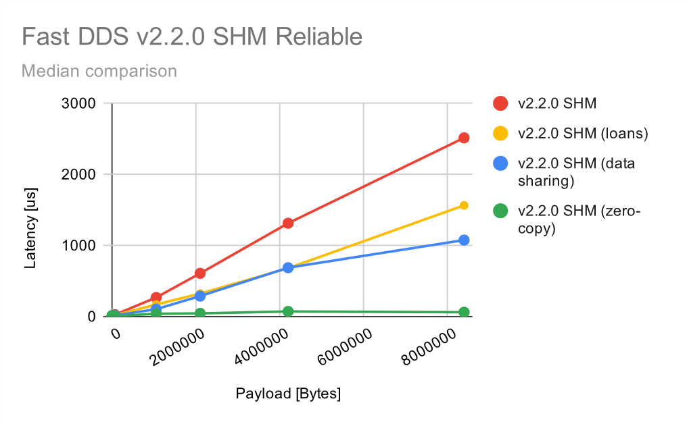

<!---
# https://discourse.ros.org/t/fast-dds-v2-2-0-latency-performance/18989
# Intra-Process Communication Performance Improvement by eProsima
--->

---

# Sync / Async Publication

in ROS aspect, we recommend async send not to block the application threads, so that application can be available for tasks in application perspective. on the other hand, async causes context switches, this could affect the latency.

- eProsima Fast-DDS can be configured (default async)
  - see [Publication Mode](https://github.com/ros2/rmw_fastrtps/blob/master/README.md#change-publication-mode) to change this behavior.
- Eclipse Cyclonedds only supports sync send.

<!---
Comment here
--->

---

# Wait for Acknowledgements

This operation blocks the calling thread until either all data written by the reliable DataWriter entities is acknowledged by all matched reliable DataReader entities, or else the duration specified by the max_wait parameter elapses, whichever happens first. A return value of OK indicates that all the samples written have been acknowledged by all reliable matched data readers; a return value of TIMEOUT indicates that max_wait elapsed before all the data was acknowledged.

<!---
Comment here
--->

---

# [Content Filtered Topics](https://docs.ros.org/en/rolling/Tutorials/Demos/Content-Filtering-Subscription.html)

- RMW Content Filtering completed. (Fast-DDS / RTI supported)
- Optimization to conserve network resource.
- [ROS2 Design Overview](https://github.com/ros2/design/pull/282)

  | DDS | Content Filter Supported? |
  | :--- | :--- |
  | Fast-DDS | Fully(Reader/Writer) Supported |
  | Cyclonedds | Not Supported |
  | RTI Connext DDS | Fully(Reader/Writer) Supported |

<!---
Comment here
--->

---

<!---
Comment here
--->

---

ContentFilteredTopic provides the improvement for CPU consumption and network traffic.

- Reader can get what they need to receive.
- Much less network consumption and user callbacks.
- Application can be agnostic from filtering.
- Filtering expression and parameter is really flexible.
- Filtering can be reconfigured at runtime.

<!---
# details can be found on https://discourse.ros.org/t/rmw-proposal-content-filtered-topic-suport/16113/6
--->

---

# [Network Identifier (ToS, DSCP)](https://design.ros2.org/articles/unique_network_flows.html)

- Differentiated Services is a widely-used QoS architecture for IP networks. The required DS-based QoS is set by the application in the 6-bit DS Code Point (DSCP) sub-field of the 8-bit DS field in the IP packet header.

- 5G network 5QI: The Network Exposure Function (NEF) in the 5G core network provides robust and secure API for QoS specification. This API enables applications to programmatically (HTTP-JSON) specify required QoS by associating 5G QoS Identifiers (5QIs) to flow identifers, as shown in the figure next.

<!---
# Ericsson AB : https://github.com/ros2/design/pull/304
--->

---

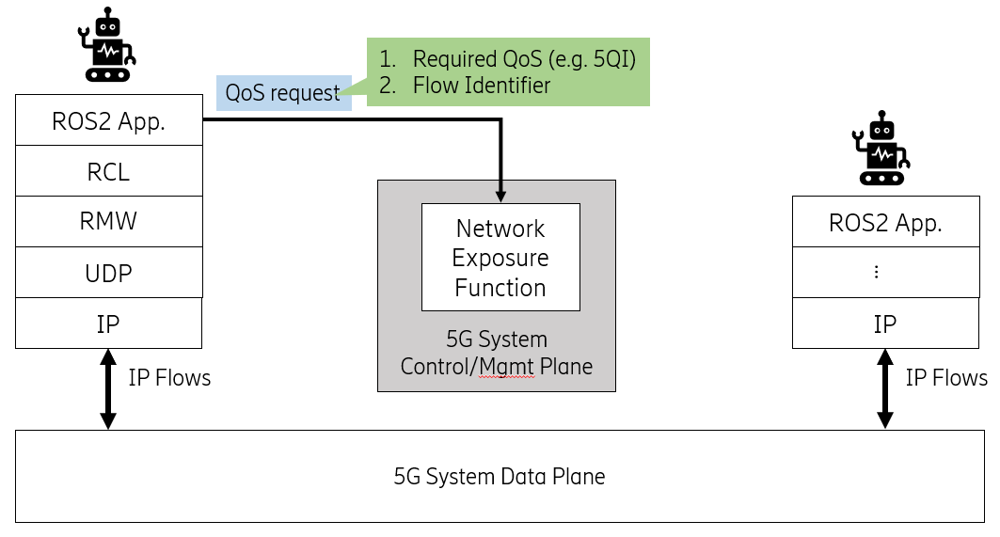

<!---
# Network Identifier can be gotten from RMW interface,
# then user can control network via iptables or so on.
--->

---

# [Micro-Controller Support](https://micro.ros.org/)

***puts ROS 2 onto microcontrollers!***

- Extend ROS 2 for Micro-Controllers / Real-Time OS
- ROS 2 agent proxy required
- [eXtremely Resource Constrained Environment DDS](https://www.omg.org/spec/DDS-XRCE/)
- [SPRESENSE w/ NuttX Supported](https://discourse.ros.org/t/support-micro-ros-on-sony-spresense-nuttx/20586)

<!---
Comment here
--->

---

<!---
Comment here
--->

---

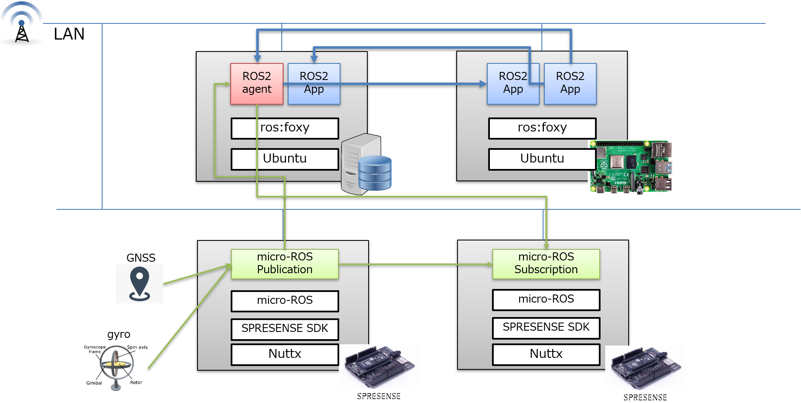

<!---
Comment here
--->

---

# Reference

- [ROS 2 Documentation Top](https://index.ros.org/doc/ros2/)
- [Governance](https://index.ros.org/doc/ros2/Governance/)
- [Why ROS 2?](https://design.ros2.org/articles/why_ros2.html)
- [ROS 2 Design](https://design.ros2.org/)
- [Micro-ROS](https://micro-ros.github.io/)

<!---
Comment here
--->
