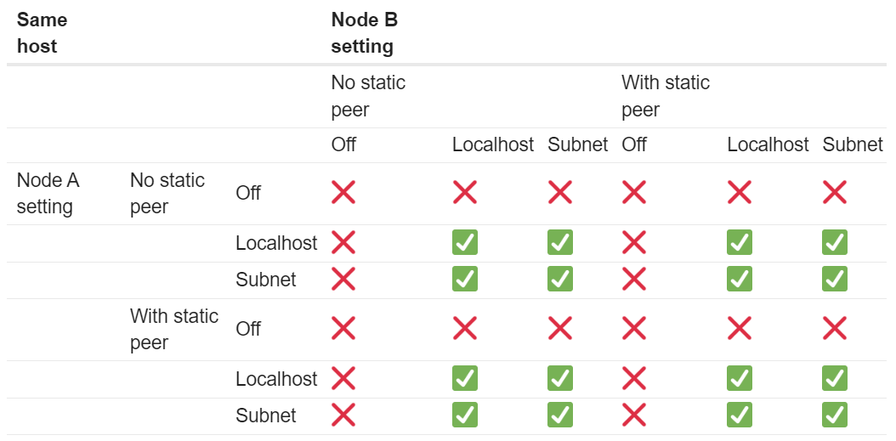
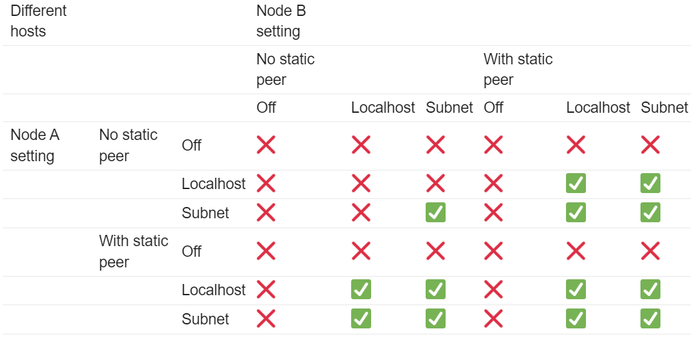

# ROS Iron Irwini - What's new -

see more details to https://docs.ros.org/en/rolling/Releases/Release-Iron-Irwini.html

<!---
Comment Here
--->

---

# Supported Platform

- Tier 1 platforms
  - Ubuntu 22.04 (amd64/aarch64)
  - Windows 10 (VS 2019) (amd64)
- Tier 2 platforms
  - RHEL 9 (amd64)
- Tier 3 platforms
  - macOS (amd64)
  - Debian Bullseye (amd64)

<!---
Comment Here
--->

---

# New Features

<!---
Comment Here
--->

---

# Service Introspection

This allows users to see the metadata and activities associated with the service, such as request, response. Optionally, the contents of the client/server requests/responses can also be introspected.
All of the information is published on a hidden topic generated from the name of the service.
So if the service is called `/myservice`, then the information will be published on `/myservice/_service_event`.

<!---
Comment Here
--->

---

- This is `opt-in` that can be enabled via `configure_introspection` on service object.
- See more details [REP 2012](https://github.com/ros-infrastructure/rep/pull/360)
- See [Client Demo](https://github.com/ros2/demos/blob/iron/demo_nodes_cpp/src/services/introspection_client.cpp) and [Service Demo](https://github.com/ros2/demos/blob/iron/demo_nodes_cpp/src/services/introspection_service.cpp)
- Additional features could leverage this feature next?
  - `ros2 service echo`
  - Playback recorded service via rosbag2
  - Introspection for ROS actions (rosbag2)

<!---
Comment Here
--->

---

# Improved Discovery

ROS Iron deprecates `ROS_LOCALHOST_ONLY` in favor of more granular options with following options.
- `ROS_AUTOMATIC_DISCOVERY_RANGE`
  - controls how far ROS nodes will try to discover each other.
  - valid options are `SUBNET`, `LOCALHOST`, `OFF`, and `SYSTEM_DEFAULT`.
  - `SUBNET` is the default, and for DDS based middlewares it means it will discover any node reachable via multicast. `LOCALHOST` means a node will only try to discover other nodes on the same machine. `OFF` means the node won't discover any other nodes, even on the same machine.

<!---
Comment Here
--->

---

# Improved Discovery

- `ROS_STATIC_PEERS`
  - is a semicolon (`;`) separated list of addresses that ROS should try to discover nodes on.
  - allows connecting to nodes on specific machines (as long as their discovery range is not set to `OFF`).
- Original Discussion
  - https://discourse.ros.org/t/proposed-changes-to-how-ros-performs-discovery-of-nodes/27640

<!---
Comment Here
--->

---

<!---
|Same host |||Node B setting ||||||
|---|---|---|---|---|---|---|---|---|
||||No static peer |||With static peer |||
||||Off |Localhost |Subnet |Off |Localhost |Subnet|
|Node A setting |No static peer |Off |:x: |:x: |:x: |:x: |:x: |:x:|
|||Localhost |:x: |:white_check_mark: |:white_check_mark: |:x: |:white_check_mark: |:white_check_mark:|
|||Subnet |:x: |:white_check_mark: |:white_check_mark: |:x: |:white_check_mark: |:white_check_mark:|
||With static peer |Off |:x: |:x: |:x: |:x: |:x: |:x:|
|||Localhost |:x: |:white_check_mark: |:white_check_mark: |:x: |:white_check_mark: |:white_check_mark:|
|||Subnet |:x: |:white_check_mark: |:white_check_mark: |:x: |:white_check_mark: |:white_check_mark:|
--->

---

<!---
|Different hosts |||Node B setting ||||||
||||No static peer |||With static peer |||
||||Off |Localhost |Subnet |Off |Localhost |Subnet|
|Node A setting |No static peer |Off |:x: |:x: |:x: |:x: |:x: |:x:|
|||Localhost |:x: |:x: |:x: |:x: |:white_check_mark: |:white_check_mark:|
|||Subnet |:x: |:x: |:white_check_mark: |:x: |:white_check_mark: |:white_check_mark:|
||With static peer |Off |:x: |:x: |:x: |:x: |:x: |:x:|
|||Localhost |:x: |:white_check_mark: |:white_check_mark: |:x: |:white_check_mark: |:white_check_mark:|
|||Subnet |:x: |:white_check_mark: |:white_check_mark: |:x: |:white_check_mark: |:white_check_mark:|
--->

---

# `Pre` and `Post` parameter callback support

`on_set` parameter callback has been supported for many releases, but it does not allow the user application flexible parameter management with callback. The new parameter callbacks support modify the parameter list incoming, modify the state if necessary.

<!---
Comment Here
--->

---

- `pre` set parameter callback, which can modify the list of parameters based on arbitrary criteria.
- `set` parameter callback, which cannot modify the list and should only accept or reject the parameters based on their type and value (already supported).
- `post` set parameter callback, which can make state changes based on parameters and is only called if the previous two callbacks are successful.
- See [C++ Demo](https://github.com/ros2/demos/blob/iron/demo_nodes_cpp/src/parameters/set_parameters_callback.cpp) and [Python Demo](https://github.com/ros2/demos/blob/iron/demo_nodes_py/demo_nodes_py/parameters/set_parameters_callback.py)

---

# Matched Events

Matched events can be generated when any publisher and subscription establishes or drops the connection between them. Users can provide each publisher and subscription with callback functions that are triggered by matched events and handle them in a way they see fit, similar to how messages received on a topic are handled.

- See more details for [matched event design](https://github.com/ros2/rmw/issues/330)
- See [C++ Demo](https://github.com/ros2/demos/blob/iron/demo_nodes_cpp/src/events/matched_event_detect.cpp) and [Python Demo](https://github.com/ros2/demos/blob/iron/demo_nodes_py/demo_nodes_py/events/matched_event_detect.py)

---

<!---
Comment Here
--->

---

# External configuration services of logger

It is now possible to configure node logger levels remotely via a service.

When the enable_logger_service option is enabled during node creation, the `set_logger_levels` and `get_logger_levels` services will be available.

Be advised that the `enable_logger_service` option is disabled by default, so the user needs to enable this option on node creation.

- See more details for [External logging level configuration](https://github.com/ros2/ros2/issues/1355)

<!---
Comment Here
--->

---

<!---
Comment Here
--->

---

# rclcpp

- Addition of a new paradigm for handling `Node` and `LifecycleNode` with `NodeInterfaces`
- default number of threads for `MultiThreadedExecutor`.
  - If the user doesn’t specify otherwise, the default number of threads for the multi-threaded executor will be set to the number of CPUs on the machine. If the underlying OS doesn’t support getting this information, it will be set to 2.

<!---
Due to various implementation considerations, they are not derived from a common base class.
This has led to some trouble for downstream code that wants to accept either a Node or a LifecycleNode.
To make this a bit better, there is now a new NodeInterfaces class that can be constructed to contain the interfaces, and then be used by other code.
--->

---

# Minor Enhancements

<!---
Comment Here
--->

---

# rclpy

- Ability to wait for another node to join the graph (`node.wait_for_node("fqdn")`)
- `AsyncParameterClient` supported
- Subscription callbacks can now optionally get the message info
- Optional argument that hides assertions for messages class (performance improvement)
- default number of threads for `MultiThreadedExecutor`. (see rclcpp)

<!---
The message info structure contains various pieces of information like the sequence number of the message, the source and received timestamps, and the GID of the publisher.
--->

---

# ros2param

- `--timeout` option to `ros2 param` when waiting node.
- `ros2 param dump` option `--output-dir` and `--print` has been removed.

<!---
`--output-dir` and `--print` is duplication of shell functionalities. so let them deprecated.
--->

---

# ros2topic

- `now` keyword for `builtin_interfaces.msg.Time` that automatically generate the time.
- `ros2 topic pub` with `--max-wait-time` to wait the subscription.
- `ros2 topic echo` with `--timeout` to wait the publication.
- `--lost-messages` option `ros2 topic echo` has been removed.
- `ros2 topic hz/bw/pub` now respect `use_sim_time`.

<!---
Comment Here
--->

---

# rosbag2

- default bag file type to `mcap`
  - default bag file type has been changed into `mcap` from `sqlite3`.
  - `mcap` file format has many of the missing features from the sqlite3 file format, and should also be more performant.
  - The old `sqlite3` file format is still available and can be selected by the user for writing if desired.

<!---
ROSCon 2022 Slides: http://download.ros.org/downloads/roscon/2022/MCAP%20A%20Next-Generation%20File%20Format%20for%20ROS%20Recording.pdf
--->
