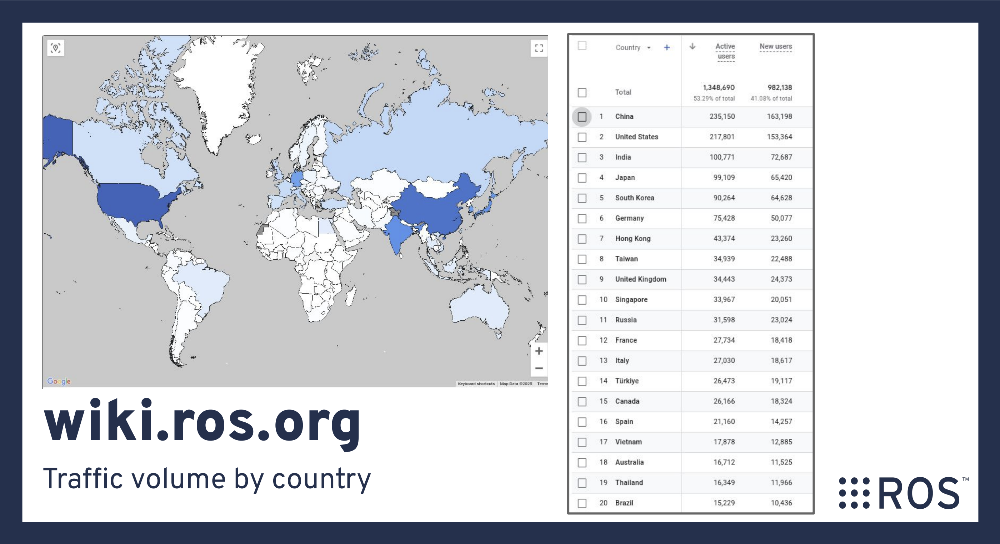

# ROS Japan Developer Kaigi(会議)

## [Tomoya Fujita](https://github.com/fujitatomoya) ／ 藤田智哉 👋

- Former [ROS Technical Steering Committee](https://docs.ros.org/en/foxy/The-ROS2-Project/Governance/ROS2-TSC-Charter.html)
- [ROS Project Management Committee](https://docs.ros.org/en/rolling/The-ROS2-Project/Governance.html#current-ros-pmc-constituents)
- ROS 2 core committer and developer
- ROSCon PC／OC／EC etc...

<!---
Comment here
--->

---

# 背景／動機

日本は少し変わっていると思いませんか？？🤔

- 自動車産業の発展と歴史
- 産業構造上ロボット／自動化必要だった？
- 全部自動化する勢い(🚽トイレ、🍣寿司)
- ロボットもエンタメの分類？
- とりあえずセンサー付けようとする？

<!---
Comment here
--->

---

Please take a look at [2024 ROS Metrics Report](https://cdck-file-uploads-us1.s3.dualstack.us-west-2.amazonaws.com/flex022/uploads/ros/original/3X/3/7/37c752346eb33f4f5ebde0c513b949b15adae453.pdf) (by [Katherine Scott](https://www.linkedin.com/in/katherineascott)), the statistics as objective facts.

## Something just does not add up here... 何かおかしい。。💭💭

<!---
Comment here
--->

---

<!---
Comment here
--->

---

## つまり、、、

- めっちゃROS／ロボット好き／Love ROS 💙
- [ROS Japan User Group](https://rosjp.connpass.com/) > 3,000 users 👥
- (実は製品化を目論んでいる人／会社が多い？)

## ということは、、、

- ROSに対する課題やユースケースが多いはず。
- もっとROSを改善することが可能なはず。

<!---
Comment here
--->

---

# ROS Japan Developer Kaigi(会議)

ROS本線を開発しよう🤖
技術課題をシェアしよう🧑‍💻👩‍💻
目指せ！ROSコミッター＆メンテナー🚀🚀

# Picture me! Join now!

<!---
Comment here
--->

---

## 目的と利益

- 日本のROS／ロボット開発促進
- 技術課題などの情報共有
- 言語障壁の撤廃(英語)  
- 産学連携／コミュニティ技術連携促進  
- オープンソース開発促進

<!---
Comment here
--->

---

## 基本情報

- 言語: 日本語
- 対象: [ROS 2 Core Repositories](https://github.com/ros2/ros2)
- 対象者: ROS開発者／エンジニア／学生の方
- 形式: オンライン GoogleMeet／Bi-Weekly／50min
- GoogleGroup: https://groups.google.com/g/ros-japan-developer-kaigi
- Github: https://github.com/fujitatomoya/ros-japan-developer-kaigi
- GoogleDocs: https://docs.google.com/document/d/1Dlt-UJt6FY1bnqZRK7aHTBly3G54j2n7U6bHT6Wnigo/edit?usp=sharing

<!---
Currently google group and github repository is under my personal account.
This is expected to be a temporary repository, whenever it is ready, i would love to donate everything to the organization.
--->

---

## 具体的な活動例

- 作成したIssue、特定Issueの課題／問題共有
- Pull Requestの状況確認、質問、対策議論
- 新機能提案や技術課題の議論
- 回避策、ワークアラウンドなどの検討
- まとまった成果は、ROSCon Japan／ROSCon で発表
- [ROS 2 Documentation](https://github.com/ros2/ros2_documentation)の改善

**mainlineをベースとしたOSSのエンジニアリングを考えています。**
**技術的な議論、開発、課題以外はトピックとして扱わない予定です。**

<!---
Comment here
--->

---

## 行動規範

個人的に気を付けていることです。

- Be constructive, productive and inclusive.
- Respect, nobody works for free.
- Trust needs to be earned.
- Progress, not perfection.
- Understanding != Agreement.

<!---
Comment here
--->

---

**(Idea -> Execution)** あとはやるだけ、、、

## 記念すべき第一回

- 日時: 9月12日 (木) 21:00-21:50
- 議題: Issue/課題を募集して議論、GoogleGroupへ参加して課題を共有しましょう。
- 備考: 日程は第一回後調整したいと思います。
- **Invitation** 👉👉👉👉👉👉👉👉👉👉👉👉👉👉👉

<!---
Comment here
--->

---

# ROS Japan Developer Kaigi(会議)

日本でROS`開発`を盛り上げましょう 🥊🥊🥊

<!---
Comment here
--->
