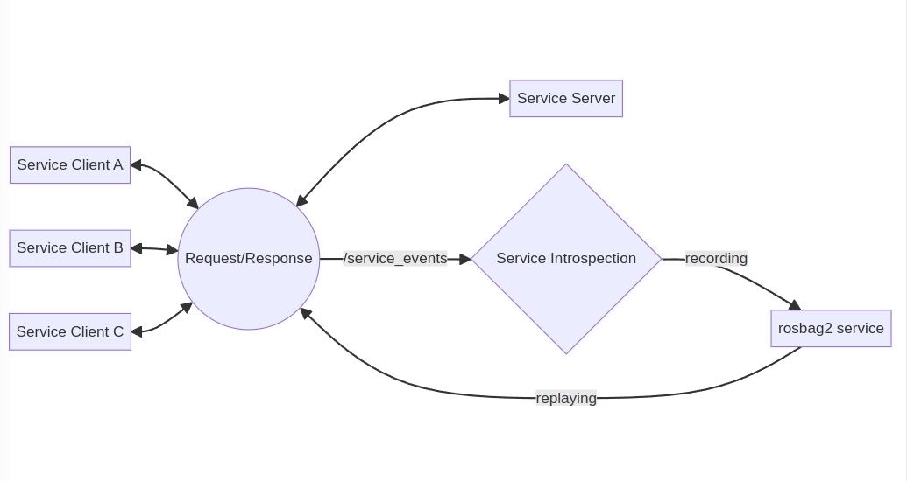

# ROS Jazzy Jalisco

## --- What's new for ROS 2 core ---

see more details to https://docs.ros.org/en/jazzy/Releases/Release-Jazzy-Jalisco.html

<!---
Discourse Release Announcement: https://discourse.ros.org/t/ros-2-jazzy-jalisco-released/37862
--->

---


# [Jazzy Documentation](https://docs.ros.org/en/jazzy/index.html)

Installation, Tutorials, How-to Guides and Packages are available.

---

# Supported Platform

- Tier 1 platforms
  - **Ubuntu 24.04 Nobel** (amd64 / aarch64)
  - Windows 10 (VS 2019) (amd64)
- Tier 2 platforms
  - RHEL 9 (amd64)
- Tier 3 platforms
  - macOS (amd64)
  - Debian Bookworm (amd64)

<!---
Reference: https://docs.ros.org/en/jazzy/Releases/Release-Jazzy-Jalisco.html#supported-platforms
--->
---

# New Features

<!---
Comment Here
--->

---


# [Preview RMW Zenoh](https://github.com/ros2/rmw_zenoh)

A new ROS MiddleWare (RMW) that integrates [Zenoh](https://zenoh.io/) with ROS 2 and [rmw_zenoh](https://github.com/ros2/rmw_zenoh) is now available. However, it is still a preview because there are some known bugs in it, and we aren’t quite ready to commit to it for the long term.

[rmw_zenoh](https://github.com/ros2/rmw_zenoh) is one of `Non-DDS` RMW implementations.

**Note that [rmw_zenoh](https://github.com/ros2/rmw_zenoh) requires `Zenh Router` daemon running.**

**To use, we need to compile ROS 2 Jazzy from source along with the [rmw_zenoh](https://github.com/ros2/rmw_zenoh)**.

<!---
Design: https://github.com/ros2/rmw_zenoh/blob/rolling/docs/design.md
--->

---

```shell
### Start the zenoh router
ros2 run rmw_zenoh_cpp rmw_zenohd

### Talker and  Listener
RMW_IMPLEMENTATION=rmw_zenoh_cpp ros2 run demo_nodes_cpp talker
RMW_IMPLEMENTATION=rmw_zenoh_cpp ros2 run demo_nodes_cpp listener
```

- By default, discovery traffic is only in local host system. If network communication is needed, we need to [configure zenoh router and restart](https://github.com/ros2/rmw_zenoh?tab=readme-ov-file#connecting-multiple-hosts).
- uses CDR as the serialization format. (Compatible with DDS based RMWs)

<!---
Comment Here
--->

---

# [rosbag2 record and replay servce](https://github.com/ros2/rosbag2/blob/rolling/docs/design/rosbag2_record_replay_service.md)

This feature depends on [Service introspection](https://github.com/ros2/ros2/issues/1285) implemented in Iron. rosbag2 takes advantage of it to record all service requests and responses, and also replays service data from the bag file.

This feature allows you to debug/enhance/test/simulate the ROS 2 services more efficiently.

<!---
Original Issue: https://github.com/ros2/rosbag2/issues/773
--->

---



<!--

NOTE: add one more dash "->", this is to avoid html comment directive.

```mermaid
graph LR
  A[Service Client A] <-> D((Request/Response))
  B[Service Client B] <-> D((Request/Response))
  C[Service Client C] <-> D((Request/Response))
  D((Request/Response)) <-> E[Service Server]
```

```mermaid
graph LR
  A[Service Client A] <-> D((Request/Response))
  B[Service Client B] <-> D((Request/Response))
  C[Service Client C] <-> D((Request/Response))
  D((Request/Response)) <-> E[Service Server]
  D((Request/Response)) -- /service_events -> F{Service Introspection}
  F{Service Introspection} -- recording -> G[rosbag2 service]
  G[rosbag2 service] -- replaying -> D((Request/Response))
```

-->

---

- Recording

  ```shell
  # All services and all topics
  ros2 bag record --all-services

  # All services
  ros2 bag record --all-services
  ```

- Playback

  ```shell
  ros2 bag play --publish-service-requests bag_path
  ```

Please check out [Managing Service Data Tutorial](https://docs.ros.org/en/jazzy/Tutorials/Beginner-CLI-Tools/Recording-And-Playing-Back-Data/Recording-And-Playing-Back-Data.html#managing-service-data) and [Design Document](https://github.com/ros2/rosbag2/blob/rolling/docs/design/rosbag2_record_replay_service.md) for more information.

---

# Core Feature Development

- [message_filters](https://github.com/ros2/message_filters/blob/rolling/index.rst)
  - Now we can use `TypeAdapter` to the subscription, so that user defined message type can be declared and converted by user callback for the filtering process.

- [rcl](https://github.com/ros2/rcl)
  - `~/get_type_description` service is added to support upcoming feature [Evolving Message Type](https://github.com/ros-infrastructure/rep/pull/381).

<!---
Comment Here
--->

---

- [rclcpp](https://github.com/ros2/rclcpp)
  - `get_service_typesupport_handle` API is added to resolve service type at runtime. this is required by rosbag2 service playback which requires dynamic service type resolving.

- [ros2cli](https://github.com/ros2/ros2cli/issues/856)
  - Now you can specify the log file name prefix with `--ros-args --log-file-name filename`. This is useful when you run with `ros2 run` because prefix is `python` by default.

<!---
Comment Here
--->

---

- [rosbag2](https://github.com/ros2/rosbag2)
  - [`Player` and `Recorder` are now exposed as rclcpp components](https://github.com/ros2/rosbag2/tree/jazzy?tab=readme-ov-file#using-with-composition). this brings the capability that you can record and play via intra-process communication with high performance.
  - [Compression threads priority control support](https://github.com/ros2/rosbag2/pull/1457).
  - [Split bag files during conversion](https://github.com/ros2/rosbag2/pull/1455).
  - bag files self-contain metadata. this means each bag file is self-contained, ready to play on anywhere.

<!---
Comment Here
--->

---

- [ros2action](https://github.com/ros2/ros2cli/tree/rolling/ros2action)
  - `type` sub-command is now supported to look up the action type.

    ```shell
    ros2 action type /fibonacci
    action_tutorials_interfaces/action/Fibonacci
    ```

<!---
Comment Here
--->

---

# Core Updates from Iron Irwini

<!---
This section shows the different or what is changed from Iron release.
--->

---

- [rcl](https://github.com/ros2/rcl)
  - [rcl_timer_call_with_info](https://github.com/ros2/rcl/pull/1113) is added to allow user application know expected timer call time and when actual timer is called. e.g user application can know the jitter and delay for the timer.
  - [rcl_wait improvement](https://github.com/ros2/rcl/pull/1146) to avoid spurious wake-ups.

- [rclcpp]()
  - [Data Racy Condition Improvement](https://github.com/ros2/rclcpp/pull/2500).
  - [Enhancement rclcpp::WaitSet](https://github.com/ros2/rclcpp/pull/2142).
  - [rclcpp::get_typesupport_handle is deprecated](https://github.com/ros2/rclcpp/pull/2209).
  - [Actual and expected call time when timer is called](https://github.com/ros2/rclcpp/pull/2343).
  - [Entity Execution Order](https://github.com/ros2/rclcpp/issues/2532) <span style="color:red">is NOT predictable (W.I.P)</span>.

<!---
Comment Here
--->

---

- [rclcpp_action](https://github.com/ros2/rclcpp)
  - [Safely release goal handle](https://github.com/ros2/rclcpp/pull/2281), to drop the handle in a locked context.

- [rclpy](https://github.com/ros2/rclpy)
  - [forbid parameter to be declared statically without initialization](https://github.com/ros2/rclpy/pull/1216).
  - Several `TypeDescriptionsInterface` enhancement for [Evolving Message Type](https://github.com/ros-infrastructure/rep/pull/381).

<!---
Comment Here
--->

---

- [rosbag2](https://github.com/ros2/rosbag2)
  - [--exclude CLI option was renamed to the --exclude-regex](https://github.com/ros2/rosbag2/pull/1480) (part of rosbag2 service development).
  - [Add node name to the Read(Write)SplitEvent message](https://github.com/ros2/rosbag2/pull/1609) to support multiple rosbag2 instance.
  - [Signal Handling Enhancement](https://github.com/ros2/rosbag2/pull/1301).
  - [Add topic_id returned by storage to the TopicMetadata](https://github.com/ros2/rosbag2/pull/1538), performance improvement with id but topic names via storage backend and tell multiple topics with id.
  - [Improve performance in SqliteStorage::get_bagfile_size()](https://github.com/ros2/rosbag2/pull/1516)

<!---
Comment Here
--->

---


# See you at [ROSCon 2024](https://roscon.ros.org/2024/)
## Odense, Denmark
## October 21st - 23rd, 2024