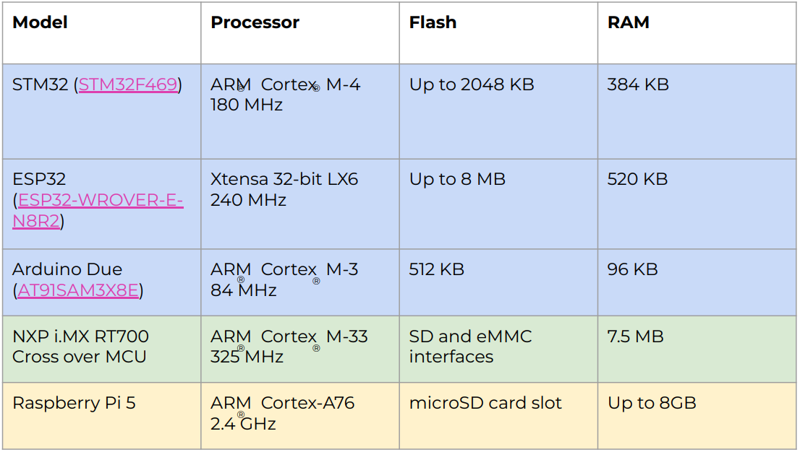
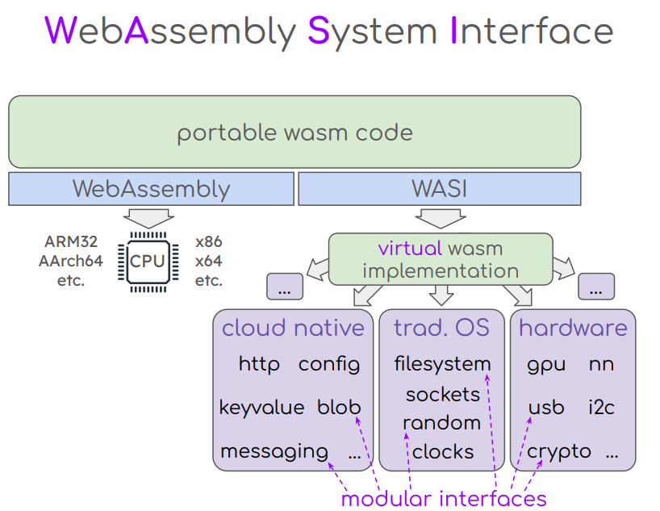
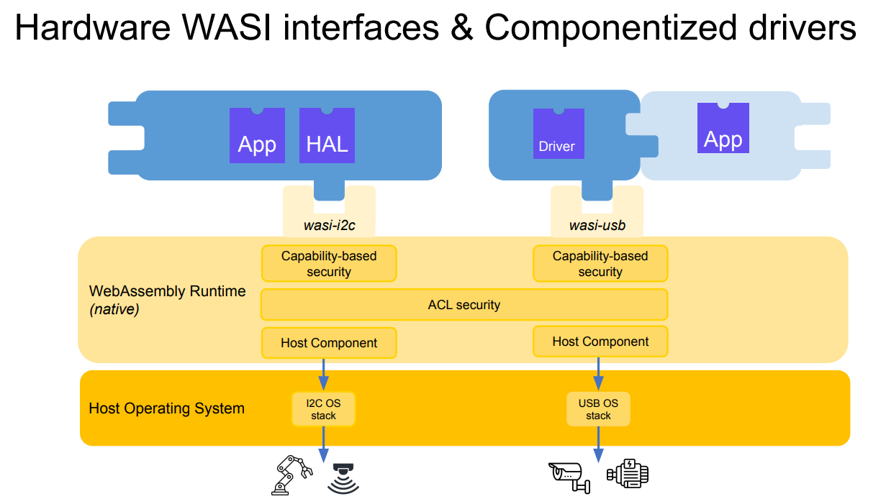
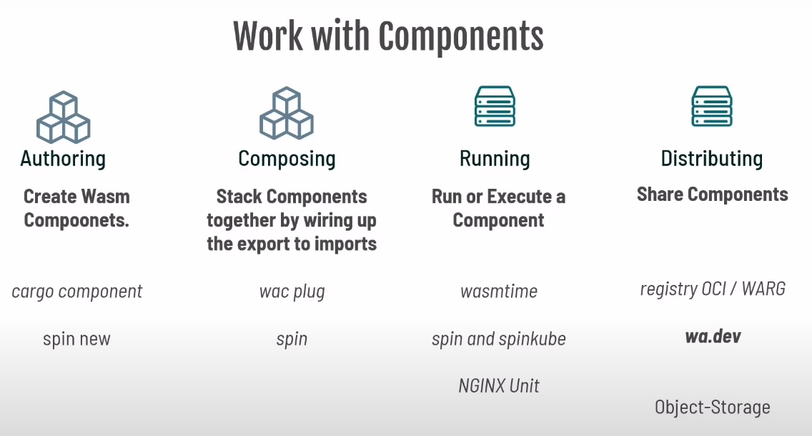

# WASMCON NA 2024 Retrospect

- [Video Playlist](https://www.youtube.com/playlist?list=PLbzoR-pLrL6o0UD4PoO0H_RnoToEiWBIS)
- [Event Schedule](https://events.linuxfoundation.org/wasmcon/program/schedule/)

<!---
# Comment Here
--->

---

# [The Wasm Wilderness](https://static.sched.com/hosted_files/wasmcon24/12/MON%20-%20V2%20KateThe_Wasm_Wilderness_Goldenring_WasmCon_2024%20%281%29.pptx.pdf?_gl=1*19mqwaz*_gcl_au*MTI1OTI4NjQ4Ny4xNzMzMzU4MDM5*FPAU*MTI1OTI4NjQ4Ny4xNzMzMzU4MDM5)

Wasm on the Edge

- Conserving energy, Edge devices are more resource and power constrained
- Scale to zero with Wasm, Wasm has instant `<1ms startup` times
- Wasm multi-tenant, secure, serverless on the edge
- Vastly heterogenous ecosystem, Wasm enables secure, portable, polyglot embedded development

<!---
# The WebAssembly Specification
# WASI 0.1 and 0.2, The Component Model, Wasm OCI Artifact Layout
--->

---

## [Secure and Efficient Sensing Applications with Wasm](https://static.sched.com/hosted_files/wasmcon24/f6/MON%20-%20Dan%20Midokura%20WasmCon%202024%20Keynote%20Final.pptx.pdf?_gl=1*gf6255*_gcl_au*MTI1OTI4NjQ4Ny4xNzMzMzU4MDM5*FPAU*MTI1OTI4NjQ4Ny4xNzMzMzU4MDM5)

- IoT fragmentation generates non-portable applications
- Lack of isolation a real concern in IoT security
- Embedded development dominated by C/C++, but AI & Data frameworks are mostly Python
- Lightweight Execution, Environment Write Once, Run Anywhere, Secure by Default, Polyglot Programming

<!---
# Comment Here
--->

---

<!---
# Comment Here
--->

---

## [WASI 0.2 to 0.3 and beyond](https://static.sched.com/hosted_files/wasmcon24/b7/WasmCon%202024%20-%20Incrementally%20extending%20WASI%200.2%20to%200.3%20and%20beyond.pdf?_gl=1*zct65f*_gcl_au*MTI1OTI4NjQ4Ny4xNzMzMzU4MDM5*FPAU*MTI1OTI4NjQ4Ny4xNzMzMzU4MDM5)

a virtualized collection of modular interfaces between wasm and the outside world that are in the process of being standardized

- WASI every 2 months development cycle
- WASI 0.3: native async support !!!
- [Wasm OCI Artifact layout](https://tag-runtime.cncf.io/wgs/wasm/deliverables/wasm-oci-artifact/): representation of a component or module as an OCI Artifact to take advantage of massive existing OCI tooling and cloud infrastructure

<!---
# Comment Here
--->

---

<!---
# Comment Here
--->

---

## [WASI to Go](https://static.sched.com/hosted_files/wasmcon24/a0/WASI%20to%20Go_%20Write%20Once%2C%20Go%20Anywhere.pdf?_gl=1*1pqodm2*_gcl_au*MTI1OTI4NjQ4Ny4xNzMzMzU4MDM5*FPAU*MTI1OTI4NjQ4Ny4xNzMzMzU4MDM5)

- Go 1.21: wasm/wasip1(WASI Preview 1)
  - Single-threaded: calling a go:wasmimport function blocks all goroutines
  - No network or sockets support in wasip1
- [wit-bindgen-go](https://component-model.bytecodealliance.org/design/wit.html): Command-line tool to generate Go from WIT
- TinyGo 0.33.0 released with native support for WASI 0.2
- Other things: wasi-http-go

<!---
# I believe that what is going on here is to enable Go with WASI and component model.
# so that user can bind and generate the Go/TinyGo to the component model and web assembly.
--->

---

## [Wasm and OCI spec](https://wasmcon24.sched.com/event/1iTbx/contain-yourself-wasm-and-the-oci-spec-taylor-thomas-cosmonic-james-sturtevant-microsoft?iframe=no&w=100%&sidebar=yes&bg=no)

[WASM OCI Image Specification](https://github.com/solo-io/wasm/blob/master/spec/spec.md) defines how to bundle WASM modules as OCI images. WASM OCI Images consist of a WASM binary file, configuration file, and metadata for the target WASM runtime.

- WIT (Wasm Interface Types): text format that is the IDL for Wasm Component.
- Component: Wasm binary that can communicate and be composed with other components.
- WIT Package: Wit text files encoded as a component, primary way for sharing interfaces.

<!---
# demonstrate how to package and distribute Wasm components as OCI artifacts, enabling their seamless integration into existing cloud-native environments. Live demos illustrate the use of common tools to pull Wasm components from a registry and run them across different runtimes, such as runwasi and wasmCloud. The session emphasizes the benefits of using the OCI spec for Wasm, including standardized distribution, discovery, and dependency management.
--->

---

## [A Walking-Tour of wasm-tools](https://static.sched.com/hosted_files/wasmcon24/37/WasmCon%202024_%20A%20Walking%20Tour%20of%20Wasm-Tools.pdf?_gl=1*lbgygs*_gcl_au*MTI1OTI4NjQ4Ny4xNzMzMzU4MDM5*FPAU*MTI1OTI4NjQ4Ny4xNzMzMzU4MDM5)

- CLI and Rust libraries for low-level manipulation of WebAssembly modules
- Open source repository [bytecodealliance/wasm-tools](https://github.com/bytecodealliance/wasm-tools)
  - There seems to be a couple of similar projects but this is mainline under Byte Code Alliance.

<!---
# Comment Here
--->

---

## [WebAssembly at Google](https://static.sched.com/hosted_files/wasmcon24/d7/WebAssembly%20at%20Google%20%28WasmCon%29.pdf?_gl=1*aefvus*_gcl_au*MTI1OTI4NjQ4Ny4xNzMzMzU4MDM5*FPAU*MTI1OTI4NjQ4Ny4xNzMzMzU4MDM5)

- can't provide you with the complete view of WebAssembly at Google.
- Google contributes to WebAssembly’s standardization.
- Google Wasm projects
  - Emscripten: C / C++ / LLVM to WebAssembly
  - Binaryen: Wasm tools used by Emscripten and many other toolchains (Dart (Flutter), Java (J2CL), Kotlin, and Rust)
- Products
  - Google Earth: ported to Web with WebAssembly.
  - Google Sheets, Google Photos, Google Meet, Skia ...

Google bets heavily on Wasm—visibly (what we shared today) and hidden behind the curtains.

<!---
# Comment Here
--->

---

## [Distributing and Running Containers for Wasm-Enabled Environments](https://static.sched.com/hosted_files/wasmcon24/1e/c2w.pdf?_gl=1*1biu0lz*_gcl_au*MTI1OTI4NjQ4Ny4xNzMzMzU4MDM5*FPAU*MTI1OTI4NjQ4Ny4xNzMzMzU4MDM5)

- Leveraging existing apps on browser (dev environment, playground, building block, etc)
- Leveraging Wasm features for running apps outside of browser
- porting apps to Wasm is hard...
- `container2wasm` enables to run containers on Wasm with CPU emulation
- Experimental support of QEMU on browser

<!---
# Comment Here
--->

---

## [Exploring the Landscape for Open Telemetry for Wasm](https://wasmcon24.sched.com/event/1rTpo/exploring-the-landscape-for-open-telemetry-for-wasm-shivay-lamba-couchbase-saiyam-pathak-loft-labs?iframe=no&w=100%&sidebar=yes&bg=no)

- Challenges in WASM observability is that WASM does not really know about the host, nor access... like timestamps for clocks and IPC calls...
- Most of OTEL libraries are developing to WASM.
- WASI logging demo
- ObserveSDK adapter exports the telemetry data to OpenTelemetry. 

<!---
# Comment Here
--->

---

## [WebAssembly for IoT Devices](https://static.sched.com/hosted_files/wasmcon24/5e/2024%20-%20WebAssembly%20for%20IoT%20Devices_%20Interfacing%20with%20USB%20and%20I2C%20Hardware%20-%20Wasmcon-2.pdf)

- Interfacing with USB and I2C Hardware
- Average lifespan of cars in Europe is 30 years...

Binary device portability across ISAs (Instruction Set Architectures) and platforms. ̶Support for more programming languages and language interoperability on embedded devices.̶ Forward compatibility with newer application toolchains over multiple decades .̶Secure and sandboxed execution of software, where other solutions like containers do not fit.

<!---
# Comment Here
--->

---

<!---
# Comment Here
--->

---

- [wasi-usb](https://github.com/WebAssembly/wasi-usb/tree/main)
- [wasi-i2c](https://github.com/WebAssembly/wasi-i2c)

- Latency to USB device: +0.007ms
- USB throughput: -0.6%

- W.I.P: GPIO / SPI

<!---
# Comment Here
--->

---

## [COMPONENT MODEL IN SOFTWARE DEFINED VEHICLES](https://static.sched.com/hosted_files/wasmcon24/3c/WasmCon24_Petig_CM%2BSDV.pdf?_gl=1*12jgzf3*_gcl_au*MTI1OTI4NjQ4Ny4xNzMzMzU4MDM5*FPAU*MTI1OTI4NjQ4Ny4xNzMzMzU4MDM5)

- agnostic from platform, Wasm components fit anywhere including simulation environment.
- Component Model offers graphical composition.
- High level data types Option, Result, String, Vector, Future, Stream for AUTOSAR.
- secured, sandboxed execution runtime.

<!---
# Comment Here
--->

---

## [The WebAssembly Component Model](https://events.linuxfoundation.org/wasmcon/program/schedule/)

- warg: WebAssemblyRegistry
- wac: Wasm Composition
- wkg: Wasm package-tools

<!---
# Comment Here
--->

---

<!---
# Comment Here
--->
