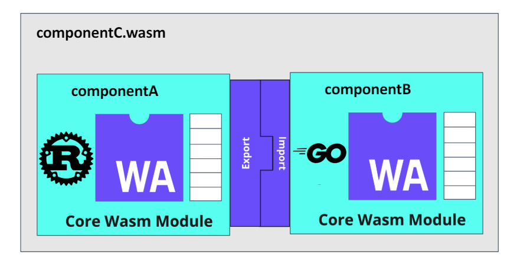
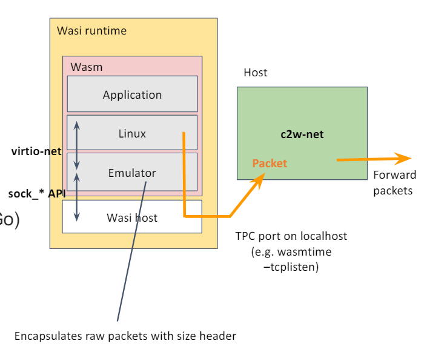
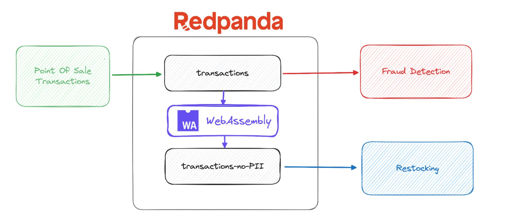
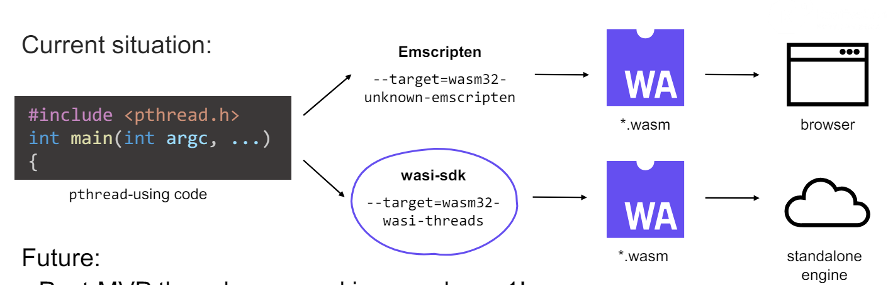

# WASM Day 2023 Recap

- [Video Playlist](https://www.youtube.com/playlist?list=PLj6h78yzYM2MEIqhZoMMKhZ6Q-XDxiDg7)
- [Event Schedule](https://colocatedeventsna2023.sched.com/overview/type/Cloud+Native+Wasm+Day)

<!---
# Comment Here
--->

---

# [WebAssembly Component Model: Enhancing Security, Productivity, and Green Computing](https://static.sched.com/hosted_files/colocatedeventsna2023/ba/Bailey-Kate-CloudNativeWasmDay-NA-2023.pptx.pdf)

WebAssembly component model for

- Isolated, memory containment.
- Mitigatable, fix and replace where it needs to be.
- Portable, language agnostic.

<!---
# Comment Here
--->

---



## [WASM Component Model](https://component-model.bytecodealliance.org/)

is a broad-reaching architecture for building interoperable Wasm libraries, applications, and environments.

<!---
# Comment Here
--->

---


## WASM Component Model Example

- Isolate responsibility and functionality.
- Only replace where it needs to be.
- Focus on application business logics.
- Language-free Modularity.

<!---
# Comment Here
--->

---

## [Running Linux-Based Containers on Wasm and Browser with Container2wasm Converter](https://static.sched.com/hosted_files/colocatedeventsna2023/3c/c2w.pdf)

- Convert Linux containers to WASM with CPU emulators.
- Leveraging existing apps on browser.
- Leveraging Wasm features for existing applications.

<!---
# Comment Here
--->

---

### [container2wasm](https://github.com/ktock/container2wasm)

```bash
$ c2w ubuntu:22.04 ubuntu.wasm
$ wasmtime ubuntu.wasm uname -sm
Linux x86_64
```

- Apps/Linux Kernel in the containers are running on the emulator. (either x86_64 or RISC-V)
- Dependencies (emulator, kernel, container rootfs, runc, etc.) are packaged into a single WASM image

<!---
# Comment Here
--->

---



- file system is provided by [wasi-vfs](https://github.com/kateinoigakukun/wasi-vfs) through the emulation.
- network is provided outside of wasm runtime, running on the host system.

so this is still limited use case, but possibly explore the current containers running in browsers and wasm runtime. Downside are,

- emulation overhead, image size and loading time and so on...

<!---
# Comment Here
--->

---

## [Extending Sidecarless Applications with Wasm in Istio Ambient Mesh](https://colocatedeventsna2023.sched.com/event/1Rj2n/extending-sidecarless-applications-with-wasm-in-istio-ambient-mesh-lin-sun-ben-leggett-soloio)

- [Istio Ambient Service Mesh](https://istio.io/latest/blog/2022/introducing-ambient-mesh/) uses [eBPF for traffic redirection](https://istio.io/latest/blog/2023/ambient-ebpf-redirection/).
- Sidecars must be “injected” into applications by modifying their Kubernetes pod spec and redirecting traffic within the pod.
- eBPF cannot support all the features proxy requires... especially higher levels.
- [The Proxy-Wasm sandbox API replaces Mixer as the primary extension mechanism in Istio](https://istio.io/latest/docs/concepts/wasm/).

<!---
# Comment Here
--->

---



## [Data Streaming System with WebAssembly](https://static.sched.com/hosted_files/colocatedeventsna2023/dc/Data%20Transforms%20Slides%20-%20WasmDay%20KubeCon.pdf)

- Inject custom logics in data streaming.
- Language agnostic and isolation.

<!---
# Comment Here
--->

---

## [Exploit Parallelism for AI Workloads with Wasm and OpenMP](https://static.sched.com/hosted_files/colocatedeventsna2023/19/WasmDay2023-Wasm%2BOpenMP.pdf)



<!---
# Comment Here
--->

---

- Edge computing has a need for parallel execution (OpenMP) and portability (WebAssembly)
- OpenMP provides fork-join parallelism to exploit inherent parallelism in an application within a shared memory architecture
- OpenMP program in WebAssembly beta, but spawn four threads, print the thread ID compiled with wasi-sdk-20 and executed in Wasmtime.

<!---
# Comment Here
--->

---

## [Wasm Is Becoming the Runtime for LLMs](https://colocatedeventsna2023.sched.com/event/1Rj3t/wasm-is-becoming-the-runtime-for-llms-michael-yuan-second-state)

https://huggingface.co/juntaoyuan/llawa

```bash
curl -sSf https://raw.githubusercontent.com/WasmEdge/WasmEdge/master/utils/install.sh | bash -s -- --plugins wasi_nn-ggml
curl -LO https://github.com/second-state/llama-utils/raw/main/chat/llama-chat.wasm
wasmedge --dir .:. \
  --nn-preload default:GGML:AUTO:llama-2-7b-chat-wasm-q5_k_m.gguf \
  llama-chat.wasm --reverse-prompt "</s>"
```

<!---
# Comment Here
--->
