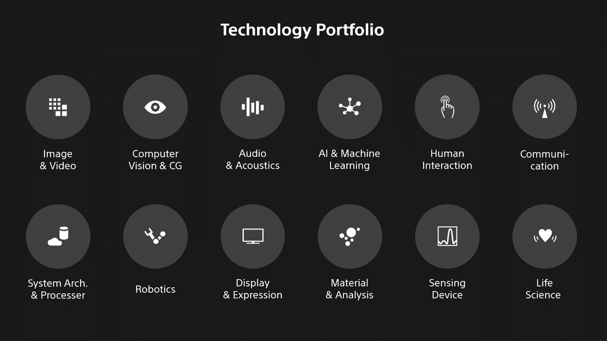
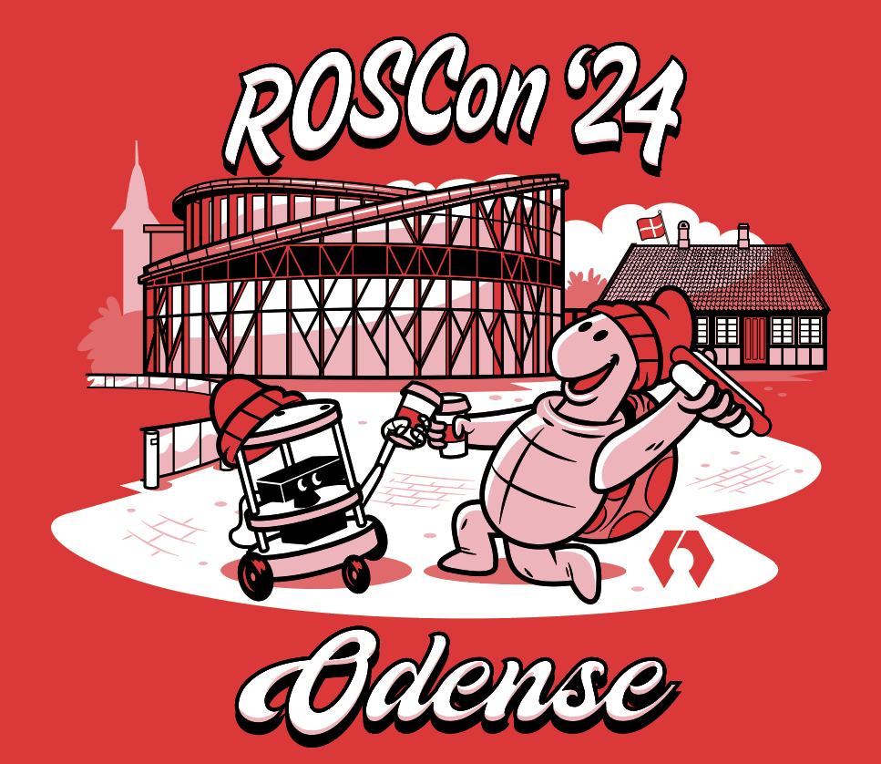

# Sony R&D Center ROS Development / Activity

Tomoya Fujita - Tomoya.Fujita@sony.com

R&D US Laboratory
Sony Corporation of America

<!---
Comment here
--->

---

# Who am I?

Senior Staff Engineer
Sony R&D Center, US Laboratory
Former [ROS TSC (Technical Steering Committee)](https://docs.ros.org/en/rolling/The-ROS2-Project/Governance.html#technical-steering-committee-tsc)
[OSRA ROS Project Management Committee](https://www.ros.org/)

<!---
Comment here
--->

---

<!---
Comment here
--->

---

<!---
Comment here
--->

---

<!---
Comment here
--->

---

# [Open Source Robotics Alliance](https://osralliance.org/)

- The OSRA is the last step in a yearlong process to move ROS, Gazebo, Open-RMF, and Infra to an independent non-profit organization. 
- OSRA is currently seeking members, both individuals and organizations to financially support the ROS infrastructure and its development. 

<!---
Comment here
--->

---

# Why Open Source matters?

- **Network Effects / Feedback Circles**
  - Value increases based on size of use cases
  - Bigger community, more ideas, variety of experience and skills
  - Standard API / Interface, Collaboration / Presence

- Open Source is the new “Standard”: Linux is the `standard` Operating System

- **Cost Effective**
  - Only specific part of product is `differentiating` feature

<!---
Comment here
--->

---

<!---
Comment here
--->

---

<!---
Comment here
--->

---

<!---
Comment here
--->

---

# ROS Community

- [Open Source Robotics Alliance](https://osralliance.org/) -> Project Management

- [Working Groups](https://docs.ros.org/en/rolling/The-ROS2-Project/Governance.html#working-groups-wgs) -> Specific Interests, Usecases

- [ROS Discourse](https://discourse.ros.org/) -> Discussion
 
- [Robotics Stack Exchange](https://robotics.stackexchange.com/) -> Questions

- [ROS Github](https://github.com/ros2) -> Development

- [ROSCon](https://roscon.ros.org/2024/) -> Global Conference

<!---
Comment here
--->

---

# Sony Robotics Products

- **[aibo](https://www.youtube.com/watch?v=CdQnfga65W0), [poiq](https://www.youtube.com/watch?v=0cDQA62KGP8) and [Airpeak S1 Drone](https://www.youtube.com/watch?v=U8KA55Vu07c)**
  - All there products are based on ROS 1 and empowered by Open Source.

- **Features Sony developed in the past**
  - [True Zero Copy Data Sharing via Fast-DDS](https://vimeo.com/378682450)
  - [Wait for Acknowledgements](https://github.com/ros2/examples/blob/rolling/rclcpp/topics/minimal_publisher/member_function_with_wait_for_all_acked.cpp)
  - [Content Filtered Topic](https://docs.ros.org/en/rolling/Tutorials/Demos/Content-Filtering-Subscription.html)
  - minor enhancements, many bug fixes and so on.

<!---
Comment here
--->

---

# Let's just jump in ROS Community

- 1st, let’s do it! We can always ask for the help!
- Be constructive, productive and inclusive! Let’s say “we”!
- Respect, nobody works for free. (Don’t ignore feedback)
- But trust needs to be earned.
- Solve community problem, not only yours.
- Worldwide community / different culture.
